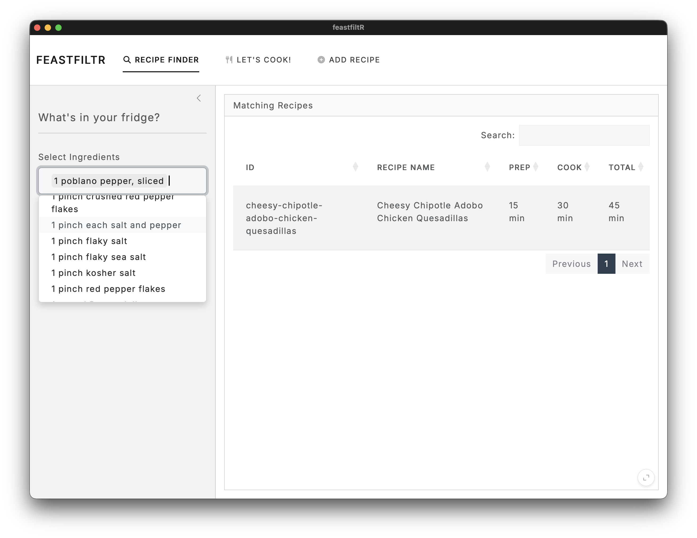
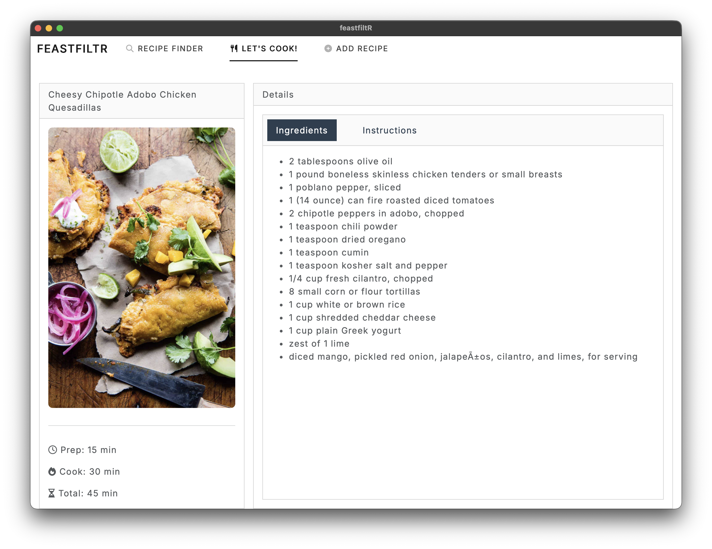

# feastfiltR: The Slater Family Cookbook

A modern recipe management and discovery tool. `feastfiltR` allows you to maintain a local database of your favorite recipes, search for what to cook based on the ingredients you have on hand, and view them in a beautiful desktop application.




## Features

- **Ingredient-Based Discovery**: Use the "Recipe Finder" to select ingredients from your pantry and find matching recipes.
- **Local Recipe Viewer**: The "Let's Cook!" tab provides a clean, distraction-free view of your recipes with full instructions and images.
- **Easy Import**: Add new recipes from any URL directly within the app's interface.
- **DuckDB Backend**: Blazing fast SQL-based searching and structured data storage.
- **Desktop Experience**: Runs as a standalone macOS application via a Python wrapper.
- **Beautiful Exports**: Still maintains the ability to generate a Quarto PDF cookbook.

## Quick Start

### Launch the Desktop App

To start the application in a standalone window, run:
```zsh
./.venv/bin/python3 desktop_app.py
```

### Launch the Web App

If you prefer to run the app in your favorite browser:
```zsh
Rscript run_app.R
```

## Advanced Usage

### Manual PDF Generation

You can still render the static PDF cookbook using Quarto:
```zsh
quarto render cookbook
```

### Command Line Tools

- `add_recipe.R <url>`: Add a single recipe from the terminal.
- `bulk_add_hbh_recipes.R <limit>`: Batch import recipes from Half Baked Harvest.
- `migrate_to_db.R`: Re-sync your `.qmd` files in `cookbook/` with the DuckDB database.

## Project Structure

- `app.R`: Main Shiny application logic.
- `global.R`: App configuration and database connectivity.
- `desktop_app.py`: Python wrapper for the desktop window.
- `recipes.duckdb`: The central recipe database.
- `cookbook/`: Source `.qmd` files and images for the cookbook.
- `R/`: Core scraping and utility functions.
