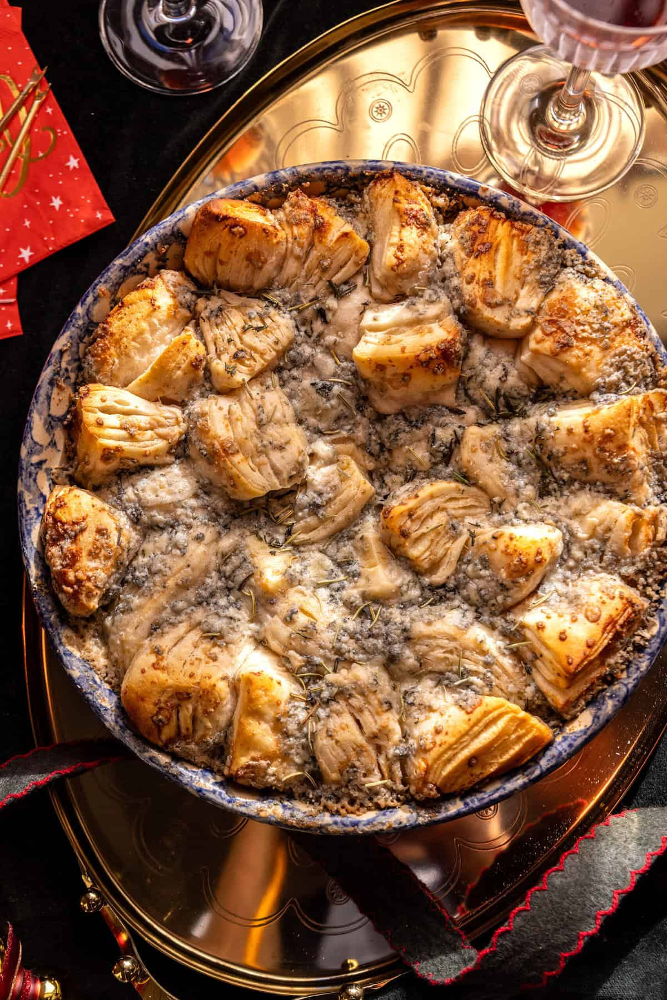

{width=100%}

**Prep Time:** 10 min | **Cook Time:** 15 min | **Total Time:** 25 min

## Ingredients

- 1 (10 ounce) can refrigerated biscuit dough
- 1 stick  salted butter
- 5  ounces  crumbled blue cheese  ((not fancy))
- dried rosemary or parsley  (optional)

## Instructions

1. Preheat the oven to 350° F. Rub a 9-inch pie plate with soft butter.
1. Cut each biscuit into quarters and arrange inside the pie plate. Pour melted butter over biscuits. Top with blue cheese.
1. Bake 10-15 minutes. Top with herbs if desired.Make it Fancy: add honey and sea salt. Use dried cranberries for festive color.

