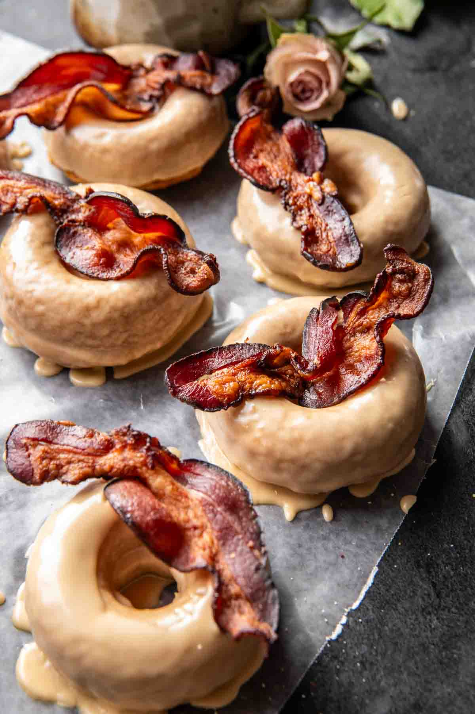

{width=100%}

**Prep Time:** 20 min | **Cook Time:** 20 min | **Total Time:** 40 min

## Ingredients

- 1/4 cup melted coconut oil
- 1 tablespoon vanilla extract
- 2  large eggs at room temperature
- 1/2 cup maple syrup
- 1/2 cup milk
- 2 cups whole wheat pastry flour (or all-purpose)
- 1 1/2 teaspoons baking powder
- 1 teaspoon baking soda
- 1 teaspoon ground cinnamon
- 1/4 teaspoon ground cardamom
- 1/2 teaspoon kosher salt
- 4 tablespoons salted butter
- 1/3 cup maple syrup
- 1 cup powdered sugar
- 1 teaspoon vanilla extract
- 12 slices cooked bacon, broken in half

## Instructions

1. Preheat the oven to 350° F. Grease a 6-cup doughnut pan or 12-cup muffin pan with melted butter2. In a mixing bowl, stir together the coconut oil, eggs, vanilla, maple syrup, and milk until combined. Add the flour, baking powder, baking soda, cinnamon, cardamom, and salt, mix until just combined.
1. Divide the batter evenly among the prepared pan, filling 1/2-2/3 of the way full. Bake 12-13 minutes, until just set. Remove and let cool 5 minutes, then run a knife around the edges to release and invert the pan.
1. Meanwhile, make the glaze. Add the butter to a small pot set over medium heat. Allow the butter to brown slightly until it smells toasted, about 2-3 minutes. Remove from the heat and whisk in the maple syrup, powdered sugar, and vanilla. Dip or drizzle the doughnuts into the glaze. Let set 2-3 minutes, then add a slice or 2 of bacon on top.

