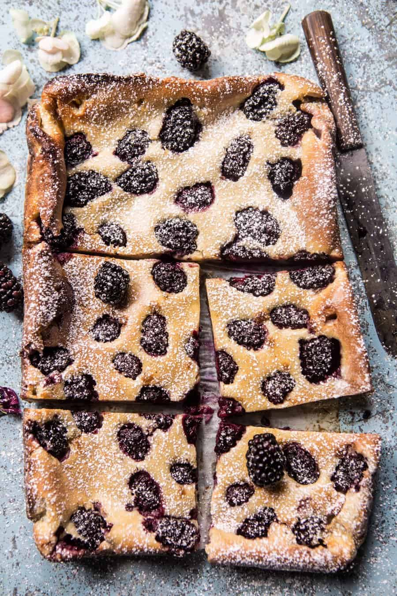

{width=100%}

**Prep Time:** 10 min | **Cook Time:** 30 min | **Total Time:** 40 min

## Ingredients

- butter, for greasing
- 1/2 cup granulated sugar
- 1 tablespoon dried lavender ((use another tablespoon for more flavor))
- 1 1/4 cups whole milk
- 3 large eggs
- 2 teaspoons vanilla extract
- 1 pinch kosher salt
- 1 cup all purpose flour
- 2 cups fresh blackberries
- 1/3 cup white chocolate chips
- powdered sugar, for dusting

## Instructions

1. Preheat the oven to 350 degrees F. Grease an 10 inch baking dish with softened butter.
1. In a blender or food processor, combine the sugar and lavender and pulse until ground. Remove half of the lavender sugar and set aside. To the blender, add the milk, eggs, vanilla, salt and flour. Blend until completely smooth. Pour the batter into the prepared baking dish. Sprinkle over the blackberries and white chocolate. Sprinkle the remaining lavender sugar evenly over top.
1. Bake in the center of the oven for 30 minutes or until golden and puffed on the edges. The clafoutis will sink as it cools. Dust with powdered sugar and serve warm.

