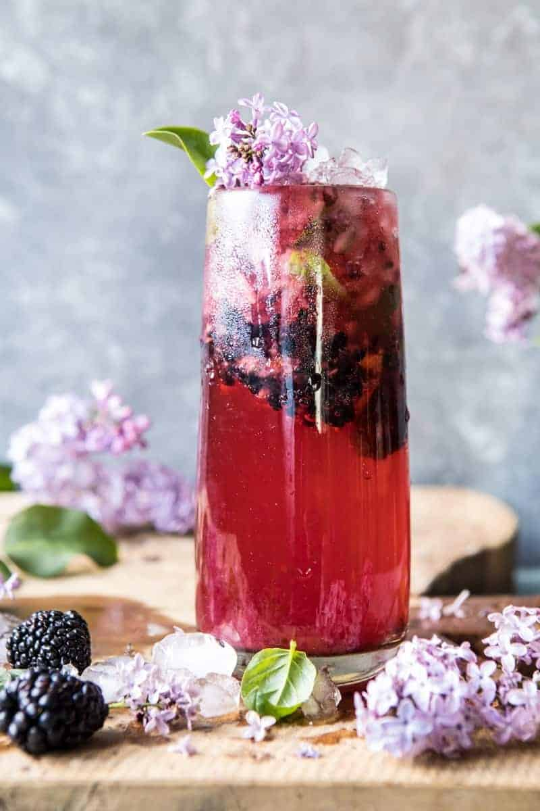

{width=100%}

**Prep Time:** 10 min | **Cook Time:** 10 min | **Total Time:** 20 min

## Ingredients

- 1/2  lemon, cut into wedges
- 6-8  fresh blackberries
- 8-12 leaves fresh basil
- 1-2 tablespoons lilac syrup or 1-2 teaspoons sweetener of choice
- 2 ounces rum
- sparkling water, for topping
- 3/4 cup water
- 1/3 cup honey
- 1/2 cup fresh lilac flowers or 1-2 tablespoons dried lavender

## Instructions

1. 

