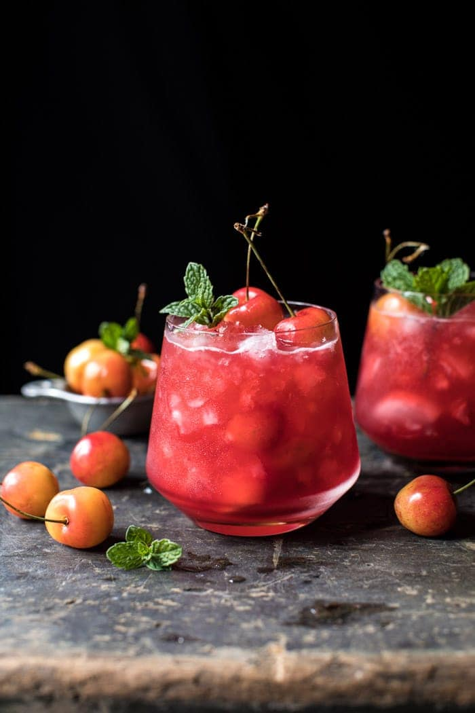

{width=100%}

**Prep Time:** 5 min | **Cook Time:**  | **Total Time:** 5 min

## Ingredients

- 4-6  fresh cherries, pitted
- juice from half a lime
- dash of orange bitters
- 1-2 tablespoons honey
- 2 ounces bourbon, more or less to taste
- fresh mint and cherries for garnish

## Instructions

1. Muddle the cherries, lime juice, orange bitters, and honey in a cocktail shaker or glass jar until the cherries are well mashed and have released their juices. Add the bourbon and shake to combine.
1. Strain (or not, I leave my cherries in!) into a cocktail glass filled with ice. If desired top with sparking water. Garnish with mint and cherries. DRINK! ?

