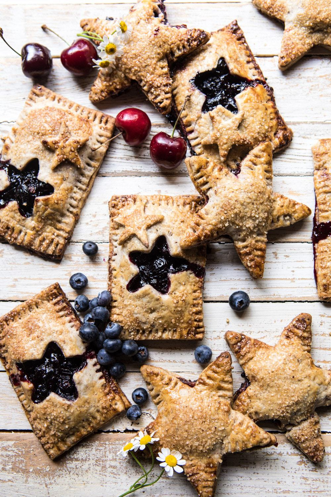

{width=100%}

**Prep Time:** 30 min | **Cook Time:** 30 min | **Total Time:** 1 hr

## Ingredients

- 3-4 cups fresh cherries, pitted
- 1/2 cup granulated sugar
- 2 teaspoons lemon juice
- 1 cup fresh blueberries
- 1-2 tablespoons bourbon
- 2 1/2 cups all-purpose flour, plus more for rolling
- 3/4 cup finely ground toasted pecans
- 1 cup (2 sticks) chilled salted butter, cut into pieces
- 1/3 cup ice water, plus more if needed
- 1  whole egg, beaten
- coarse sugar, for sprinkling

## Instructions

1. In a medium saucepan, bring the cherries, sugar, lemon juice, and 2 tablespoons water to a boil over high heat. Once boiling use a potato masher or fork to break down and mash the cherries. Continue to cook for 8-10 minutes or until the jam has reduced and thickened by 1/3. Stir in the blueberries and cook another 5 minutes.
1. Remove from the heat and stir in the bourbon. Let cool completely before filling.
1. To make the crust. Add the flour pecans and butter to a food processor and pulse until the mixture is combined and resembles peas. Add the ice water and mix with a wooden spoon, drizzling in more water as needed (no more than 1 tablespoon at a time), until dough just comes together (a few dry spots are ok).
1. Divide the dough in half. Shape each piece into a circular disk. At this point you can cover the dough and place it in the fridge for up to one week OR continue on with the recipe...yes, no chilling needed!
1. Roll the dough out into a 1/8-inch thickness. Cut the dough into rectangles, about 6 1/2 x 4 1/2 inches. If desired, use a small star cookie cutter to cut stars out of half of the rectangles (see above photo).
1. Place a tablespoon of jam on one half of the rectangle. Lay the other half of the dough over the filling and seal the edges by crimping with the back of a fork. Repeat until you have used all the dough, you may have leftover jam. Place the pies on parchment lined baking sheets. Cover the baking sheets and place in the freezer for 20-30 minutes to chill.
1. Preheat the oven to 375 degrees F. Brush the pies with the beaten egg and sprinkle with the coarse sugar. Bake 15-20 minutes or until golden in color. Serve warm or at room temperature.

