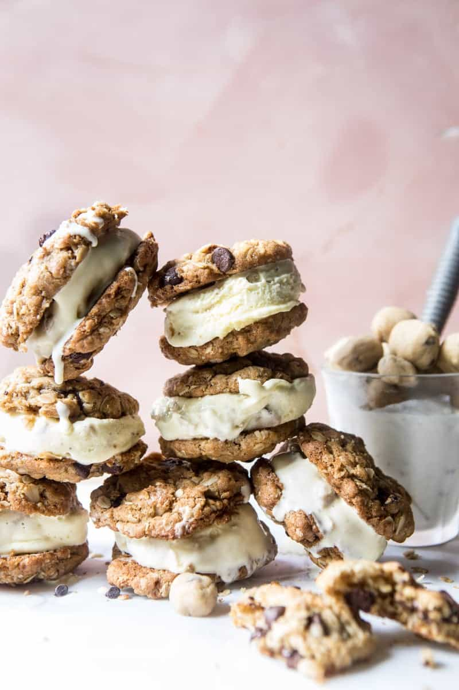

{width=100%}

**Prep Time:** 30 min | **Cook Time:** 30 min | **Total Time:** 1 hr

## Ingredients

- 5  large egg yolks
- 3/4 cup granulated sugar
- 3 cups whole milk
- 2 teaspoons vanilla
- 1/4 teaspoon flaky sea salt
- 1 stick (1/2 cup) salted butter
- 1/3 cup light brown sugar
- 1/4 cup granulated sugar
- 1  pasteurized egg
- 2 teaspoons vanilla
- 1 3/4 cups all-purpose flour
- 1 cup mini semi-sweet chocolate chips
- 1 3/4 cups old fashioned oats
- 1 cup all-purpose flour
- 1 cup packed light brown sugar
- 1/2 teaspoon baking soda
- 1/2 teaspoon salt
- 1/2 cup canola oil or melted coconut oil
- 1 large egg
- 2 teaspoons vanilla extract
- 1 cup semi-sweet chocolate chips

## Instructions

1. In a medium size pot, whisk together the egg yolks and sugar until the yolks are pale yellow in color. Add the milk, vanilla, and sea salt. Set the pot over medium high heat. Bring the mixture to a low boil. Cook, stirring consistently, until the mixture thickens and easily coats the back of a wooden spoon, about 8-10 minutes. Once thickened remove from the heat.
1. Place a fine-mesh sieve (strainer) over a large heatproof bowl and immediately strain the custard into the bowl. Cool slightly, cover and place in the fridge for 4 hours or overnight.
1. To make the cookie dough. In a large bowl, beat together the butter, brown sugar, and sugar until combined. Add the egg and vanilla and beat until combined and creamy. Add the flour and salt, beat until combined. Stir in the chocolate chips. Spread the cookie dough in an even layer on a parchment lined baking sheet. Freeze 20-30 minutes and then roughly chop the cookie dough into small, bite size pieces.
1. To make the oatmeal Cookies. Preheat the oven to 350 degrees F.
1. In a large bowl beat together the oatmeal, flour, brown sugar, baking soda, salt, canola oil, egg, and vanilla until the dough is moist and all the ingredients are combined. The dough will be crumbly. Mix in the chocolate chips.
1. Using your hands clump together a tablespoon of dough. Use you hands to really squeeze the dough into a ball. Place on a parchment lined baking sheet. Repeat with remaining dough.
1. Bake for 12-15 minutes or until set and golden. Let cool completely.
1. Churn the ice cream in an ice cream maker according to the manufacturer’s instructions. During the last few minutes of churning, add the cookie dough pieces.
1. Using an ice cream scoop, scoop 1 scoop of ice cream on to half of the cookies. Sandwich with the remaining cookies, gently pushing down. Transfer to the freezer and freeze for 4-6 hours or until firm (or eat now!). Remove 5-10 minutes before eating to soften. Enjoy!

