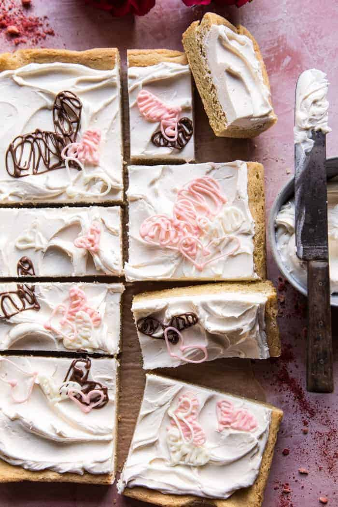

{width=100%}

**Prep Time:** 15 min | **Cook Time:** 20 min | **Total Time:** 35 min

## Ingredients

- 2 sticks salted butter, cubed
- 1 cup granulated sugar
- 2 teaspoons pure vanilla extract
- 2  eggs, at room temperature
- 2 1/2 cups all-purpose flour
- 1 teaspoon baking soda
- 1 stick salted butter
- 1/2 cup confectioners sugar
- 1 cup high quality white chocolate chips, melted and cooled to touch
- 1 teaspoon pure vanilla extract
- melted chocolate and white chocolate, for decorating

## Instructions

1. Preheat the oven to 325 degrees F. Line a 9x13 inch baking pan with parchment paper.
1. Add the butter to medium pot. Allow the butter to brown lightly until it smells toasted, about 2-3 minutes. Stir often. Remove from the heat and transfer to a mixing bowl. Let cool 5 minutes. Beat in the sugar, and vanilla. Add the eggs, one at a time, and mix until evenly combined. Add the flour and baking soda, beating until combined and the dough forms a ball. Press the dough into the prepared baking dish. Transfer to the oven and bake 20 to 25 minutes or until just golden on top. Let cool completely before frosting.
1. To make the frosting: In the bowl of a stand mixer (or large bowl with a hand mixer) beat together the butter and powdered sugar until smooth and fluffy, about 5 minutes. Add the melted white chocolate, and vanilla, beat until combined 4. Frost the cooled cookie bars and decorate as desired. Cut and serve.

