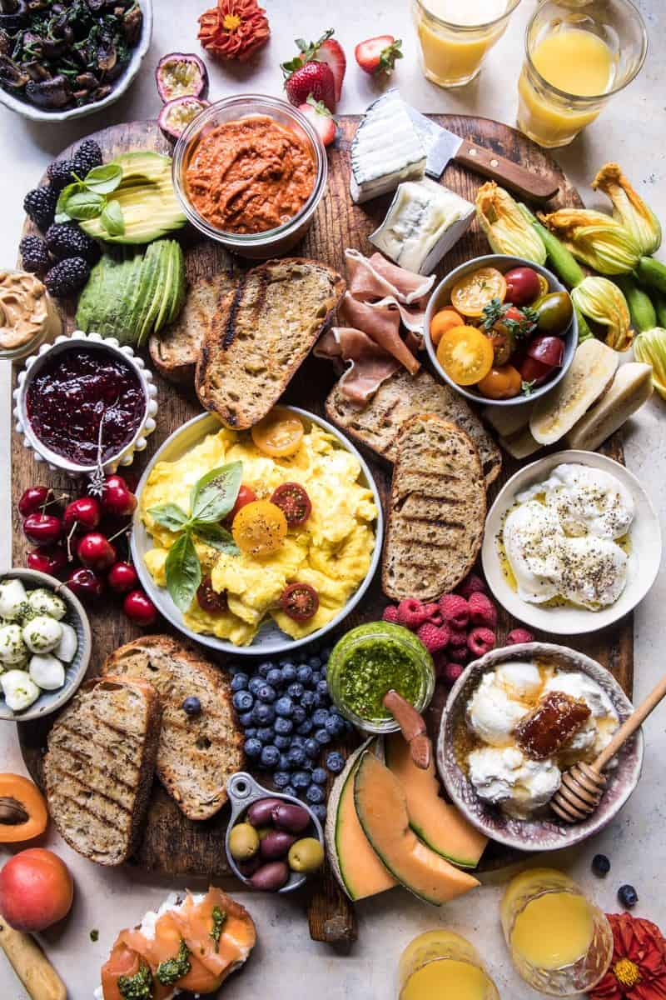

{width=100%}

**Prep Time:** 15 min | **Cook Time:**  | **Total Time:** 15 min

## Ingredients

- 1 batch basil pesto
- 1 batch Sun-Dried Tomato Muhammara ((tomato and roasted red pepper spread))
- 1 batch marinated cherry tomatoes or 2 cups tomatoes
- 6-8  soft-boiled or poached eggs
- 6-8  scrambled eggs
- 6-8 pieces fried bacon
- 2-3  cheeses ((I used Humboldt Fog goat cheese, ricotta and marinated mozzarella))
- grilled or toasted bread
- sautéed veggies, such as spinach and mushrooms
- fresh fruits
- sliced avocado
- prosciutto, salami, and smoked salmon
- raspberry jam or other fruit jams
- nut butter
- honey or honeycomb
- • not-from-concentrate Florida's Natural® Brand Orange Juice

## Instructions

1. Arrange the sauces and spreads on a large serving board. Add the poached eggs, scrambled eggs, and bread. Drizzle the poached eggs with olive oil and season with salt and pepper. Arrange the cheese, fruits, veggies, meats, jams, nut butter, and honey around the eggs.
1. Pour Florida’s Natural orange juice into juice glasses for sipping. Enjoy!

