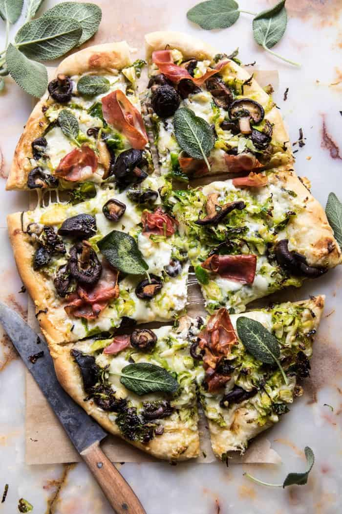

{width=100%}

**Prep Time:** 20 min | **Cook Time:** 15 min | **Total Time:** 35 min

## Ingredients

- 3 tablespoons extra virgin olive oil
- 8  fresh sage leaves
- 1 pound mixed wild mushrooms or cremini mushrooms, sliced
- kosher salt and pepper
- 2 tablespoons butter
- 1 clove garlic, minced or grated
- 1/2 cup fresh herbs, roughly chopped ((I like basil and thyme))
- 1 pound brussels sprouts, shredded
- 1/2 pound pizza dough, homemade or store-bought
- 2 tablespoons apple butter
- 1 pinch crushed red pepper flakes
- 8 ounces fresh burrata cheese
- 1 1/2 cups shredded provolone cheese
- 3 ounces prosciutto, torn

## Instructions

1. Preheat the oven to 450 degrees F. Grease a large baking sheet with olive oil.
1. Heat 2 tablespoon olive oil in a large skillet over high heat. When the oil shimmers, add the sage, fry 30 seconds. Remove from the skillet and set aside for serving. To the same skillet, add the mushrooms and season with salt and pepper. Cook undisturbed for 5 minutes or until golden, stir and continue cooking until the mushrooms have caramelized, 3-5 minutes. Reduce the heat to medium. Add the butter, garlic, and herbs. Cook, stirring occasionally until the garlic is caramelized and fragrant, about 5 minutes. Remove from the heat.
1. In a medium bowl, toss together the shredded brussels sprouts, the remaining 1 tablespoon olive oil, and a pinch each of salt and pepper.
1. On a lightly floured surface, push/roll the dough out until it is pretty thin (about a 10-12 inch circle). Transfer the dough to the baking sheet. Spread the apple butter over the dough. Break the ball of burrata over the dough and then arrange the mushrooms and brussels sprouts over top. Sprinkle on the provolone and the top with prosciutto.
1. Transfer to the oven and bake for 10-15 minutes or until the crust is golden and the cheese has melted. Top with fried sage. EAT!

