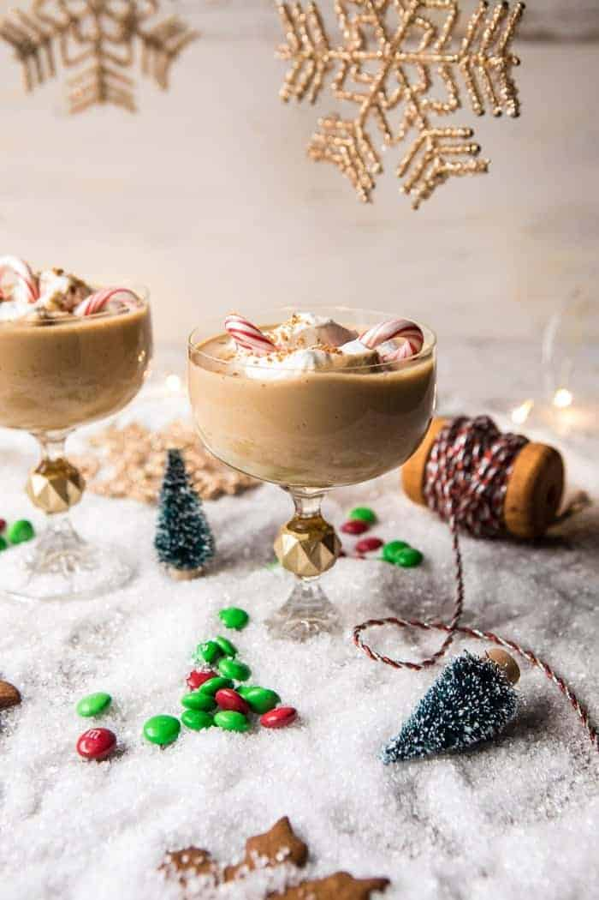

{width=100%}

**Prep Time:** 10 min | **Cook Time:**  | **Total Time:** 10 min

## Ingredients

- 4 ounces (1/2 cup) vodka
- 2 ounces (1/4 cup) Kahlúa, or more to taste
- 3 tablespoons maple syrup
- 2 teaspoon vanilla extract
- 3 teaspoons molasses
- 1/4 teaspoon ground cinnamon
- 1/8 teaspoon ginger
- 1/2 cup heavy cream, whole milk, or sweetened condensed milk
- chocolate syrup, for topping
- whipped cream, candy canes, candies, and gingerbread cookies, for serving

## Instructions

1. In a cocktail shaker combine the vodka, Kahlúa, maple syrup, vanilla, molasses, cinnamon, and ginger. Shake until well combined. Add ice and shake again. Strain into 4 glasses. Top off each glass with heavy cream, whole milk or sweetened condensed milk. Dollop with whipped cream and garnish as desired. DRINK!

