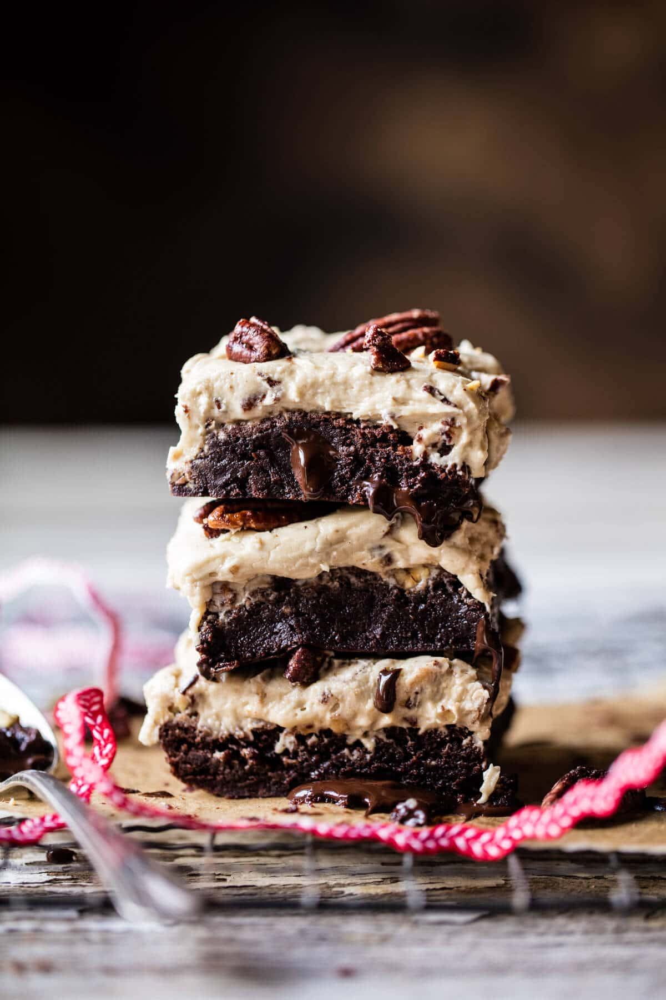

{width=100%}

**Prep Time:** 30 min | **Cook Time:** 30 min | **Total Time:** 1 hr

## Ingredients

- 2  sticks (1 cup) unsalted butter
- 4 ounces milk or dark chocolate, chopped
- 1 1/2 cups granulated sugar
- 1 tablespoon vanilla extract
- 4  large eggs
- 1 cup unsweetened cocoa powder
- 1 cup all-purpose flour
- 1/4 teaspoon kosher salt
- 1/2 cup chopped milk or dark chocolate
- 1 1/2  sticks (12 tablespoons) unsalted butter
- 2/3 cup heavy cream
- 1 cup plus 2 tablespoons packed brown sugar
- 1 1/2 cups raw pecans
- 2 tablespoons bourbon (optional)
- 3 teaspoons vanilla extract
- 1/4 teaspoon cinnamon
- 3 cups powdered sugar

## Instructions

1. Preheat the oven to 350 degrees F. Line a 9x13 inch baking dish with parchment paper.
1. Add the butter and chocolate to a medium microwave safe mixing bowl. Microwave on 30 second intervals, stirring after each interval, until melted and smooth. To the melted chocolate whisk in the sugar, vanilla and eggs and until smooth. Stir in the cocoa powder, flour and salt until just combined, try not to over mix the batter. It will be thick. Stir in chopped chocolate. Pour the batter into the prepared pan, spreading it in an even layer. Transfer to the oven and bake for 25-30 minutes, until the brownies are set on top. Remove from the oven and allow to cool.
1. Meanwhile, make the frosting. Preheat oven to 350 degrees F.
1. In a medium sauce pan, melt together 4 tablespoons butter, the cream, and brown sugar. Bring to a boil and cook for one minute or until the sugar is dissolved. Remove from the heat and add to the bowl of a stand mixer. Place the bowl in the freezer (or fridge for longer) for 15-20 minutes or until cool to touch.
1. On a parchment lined baking sheet, combine the pecans, bourbon - if using, 1 teaspoon vanilla, the remaining 2 tablespoons brown sugar and cinnamon and toss to coat. Transfer to the oven and bake for 10 to 15 minutes, stirring occasionally, until toasted. Remove, let cool 10 minutes, then roughly chop the pecans.
1. Grab the cooled butter mixture from the freezer and add the remaining 8 tablespoons butter, remaining 2 teaspoons vanilla and powdered sugar to the bowl and beat together until well combined. Fold in half of the chopped pecans. Spread the frosting onto the cooled brownies. Top with remaining pecans, using as many as desired. Slice and serve or store in and airtight container.

