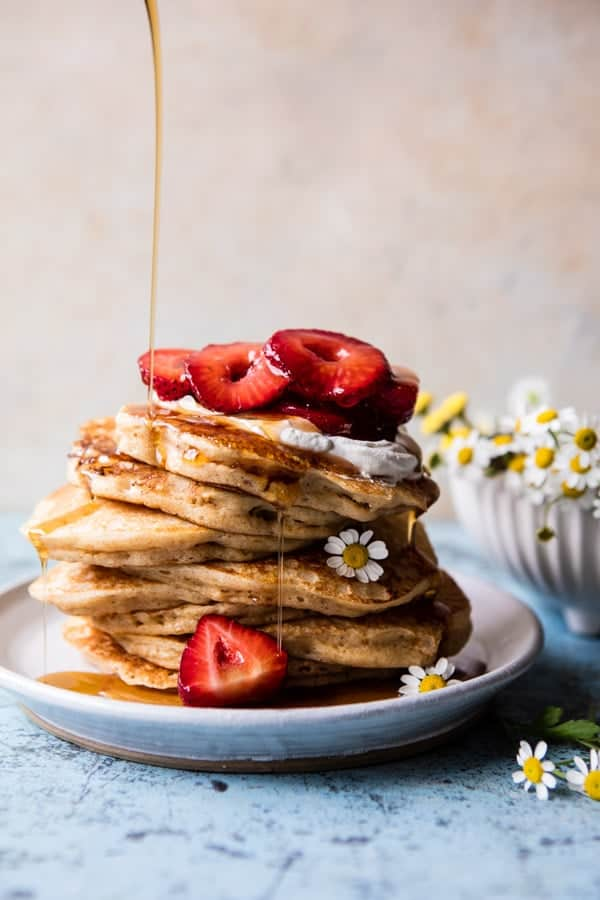

{width=100%}

**Prep Time:** 15 min | **Cook Time:** 15 min | **Total Time:** 30 min

## Ingredients

- 2 cups all-purpose flour
- 2 teaspoons baking powder
- 1/2 teaspoon cinnamon
- 1/2 teaspoon salt
- 1 1/2 cups buttermilk
- 1/2 cup plain greek yogurt
- 2  eggs
- 2 tablespoons melted butter
- 1 tablespoon vanilla
- zest from 1 lemon
- 1 cup heavy cream
- 2  chamomile tea bags
- 1 tablespoon honey
- 1/4 cup honey
- 1 inch fresh ginger grated
- 2 cups fresh strawberries sliced

## Instructions

1. To make the chamomile cream. Add 1/2 cup cream to a small saucepan and bring to a low boil, simmer 1 minute and remove from the heat. Add the tea bags, cover and steep for 5-10 minutes. Remove the tea bag and place in the fridge to chill completely. Once chilled, add the chamomile cream and remaining 1/2 cup cream to a mixing bowl and whip until stiff peaks form. Stir in the honey. Keep stored in the fridge.
1. To make the pancakes. In a large bowl, combine the flour, baking powder, cinnamon, and salt. In a small bowl, whisk together the buttermilk, yogurt, eggs, butter, vanilla, and lemon zest.
1. Pour the wet ingredients into the dry ingredients and mix the batter until just combined. It's OK if there are lumps in the batter. Cover the batter and set aside for 10 minutes.
1. Meanwhile, make the strawberries. Heat the honey and ginger in a small saucepan over medium heat until simmering. Let cool 5 minutes. Add the strawberries to a bowl and pour the honey over the berries. Toss to combine.
1. Heat a large skillet or griddle over medium heat and add the butter, or spray with cooking spray. Pour about 1/4 cup pancake batter onto the center of the hot pan. Cook until bubbles appear on the surface. Using a spatula, gently flip the pancake over and cook the other side for a minute, or until golden. Repeat with the remaining batter.
1. Serve the pancakes topped with the chamomile cream, strawberries, and maple syrup if desired. Enjoy!

