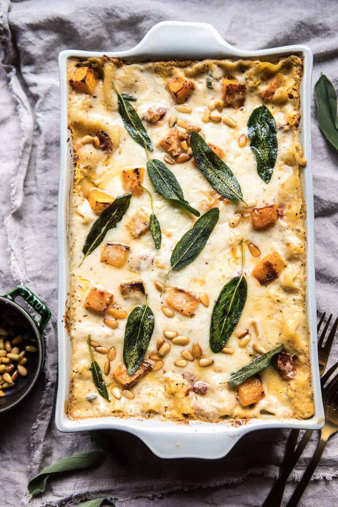

{width=100%}

**Prep Time:** 30 min | **Cook Time:** 1 hr 30 min | **Total Time:** 2 hr

## Ingredients

- 4 cups butternut squash, cubed ((about 1 medium squash))
- 2 tablespoons extra virgin olive oil
- 1 tablespoon honey
- kosher salt and pepper
- 6 tablespoons butter
- 2 cloves garlic, minced or grated
- 1 tablespoon fresh sage, chopped
- 1 tsp dried basil
- 1/4 cup flour
- 3 1/2 cups whole milk
- 1/4 teaspoon fresh grated nutmeg
- 1 cup shredded fontina cheese
- 1 cup parmesan cheese, grated
- 2 cups whole milk ricotta
- 2 cups shredded provolone
- 1 jar (8 ounce) oil packed sun-dried tomatoes, oil drained and chopped
- 1 box no-boil lasagna noodles
- 2 tablespoons toasted pine nuts

## Instructions

1. Preheat oven to 375 degrees F. Grease a 9x13 inch pan.
1. On a baking sheet, toss together the butternut squash, olive oil, honey, and a pinch each of salt and pepper. Transfer to the oven and roast for 25-30 minutes or until the squash is tender.
1. Melt the butter in a medium sauce pan. Add the garlic, sage, and basil and cook 30 seconds or until fragrant. Whisk in the flour and cook for about 1 minute. Slowly add the milk. Stir in the nutmeg and season with salt and pepper. Bring to a boil and stir for 1 minute. Remove from heat and stir in the fontina cheese and 1/2 cup of parmesan cheese. Stir until the cheese is fully melted and the sauce is smooth. Set the cheese sauce aside.
1. In a medium bowl, mash the roasted butternut squash until mostly smooth. Stir in the ricotta, provolone, and sun-dried tomatoes.
1. Spread 1/4 of the cheese sauce in the bottom of the prepared baking dish. Top with 3-4 lasagna sheets. Spread with 1/2 the butternut squash mixture and then another 1/4 of the cheese sauce. Place another 3-4 lasagna noodles on top, and then top with the remaining butternut squash mixture and another 1/4 of the cheese sauce. Add the remaining lasagna noodles and pour the remaining 1/4 of the cheese sauce over top. Top with the remaining 1/2 cup of parmesan cheese. Bake uncovered for 45 minutes or until the top has bubbled up and browned a bit. Let stand 10 minutes before serving. Top with pine nuts and fried sage.

