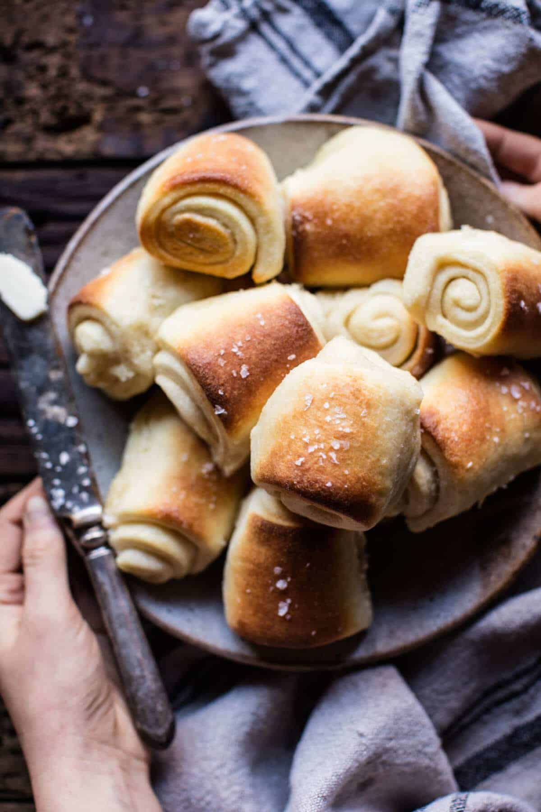

{width=100%}

**Prep Time:**  | **Cook Time:** 20 min | **Total Time:** 3 hr 10 min

## Ingredients

- 3 cups King Arthur Unbleached All-Purpose Flour
- 2 1/2 teaspoons instant yeast
- 3 tablespoons sugar
- 1 1/4 teaspoons salt
- 1/4 cup potato flour
- 3 tablespoons butter
- 1 cup milk
- 1  large egg
- 3 1/2 tablespoons to 4 butter, melted; for brushing on rolls

## Instructions

1. In a large mixing bowl, or in the bowl of an electric mixer, combine all of the ingredients (except the 3 tablespoons melted butter at the end), mixing to form a shaggy dough. Note: to speed the rising process, whisk together the milk and egg, and heat gently just enough to remove the refrigerator chill; then add to the remaining ingredients.
1. Knead the dough, by hand (10 minutes) or by machine (7 to 8 minutes) until it's smooth.
1. Place the dough in a lightly greased bowl or 8-cup measure (so you can track its rising progress). Allow it to rise for 90 minutes; it'll become quite puffy, though it probably won't double in bulk. Note that the dough takes quite awhile to get going; after 1 hour, it may seem like it's barely expanded at all. But during the last half hour, it rises more quickly.
1. Transfer the dough to a lightly greased work surface. Divide it in half. Working with one half at a time, roll or pat the dough into an 8" x 12" rectangle.
1. Brush the dough all over with a light coating of the melted butter. You'll have melted butter left over; save it to brush on top of the baked rolls.
1. Cut the dough in half lengthwise, to make two 4" x 12" rectangles. Working with one rectangle at a time, fold it lengthwise to about 1/2" of the other edge, so the bottom edge sticks out about 1/2" beyond the top edge. You'll now have a rectangle that's about 2 1/4" x 12". Repeat with the other piece of dough.
1. Cut each of the rectangles crosswise into four 3" pieces, making a total of 8 rolls, each about 2 1/4" x 3". Place the rolls, smooth side up, in a lightly greased 9" x 13" pan. Repeat with the remaining piece of dough, making 16 rolls in all. Alternately you can roll each rectangle of dough into a coil as you would a cinnamon roll.
1. You'll arrange 4 rows of 4 in the pan, with the longer side of the rolls going down the longer side of the pan. Gently flatten the rolls to pretty much cover the bottom of the pan.
1. Cover the pan, and let the rolls rise for about 45 minutes to 1 hour, until they're puffy but definitely not doubled. Towards the end of the rising time, preheat the oven to 350°F.
1. Bake the rolls for 20 to 25 minutes, until they're golden brown and feel set.
1. Remove them from the oven, and brush with the remaining melted butter. Pull them apart to serve.

