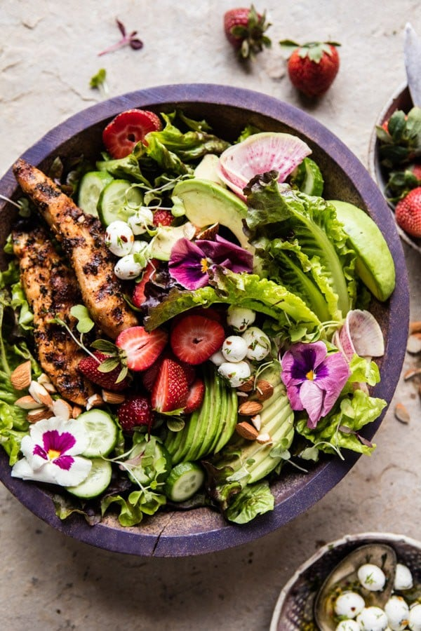

{width=100%}

**Prep Time:** 20 min | **Cook Time:** 10 min | **Total Time:** 30 min

## Ingredients

- 1 pound boneless skinless chicken tenders
- 1/4 cup extra virgin olive oil
- 4 cloves garlic, minced or grated
- 1/4 cup fresh parsley, chopped ((or 1 tablespoon dried))
- 1/4 cup fresh basil, chopped ((or 1 tablespoon dried))
- 1/2 teaspoon smoked paprika
- 1/2 teaspoon onion powder
- 1/4 teaspoon cayenne
- 1/2 teaspoon kosher salt and pepper
- 2  heads romaine lettuce, chopped
- 1 cup fresh strawberries, halved
- 2  watermelon radishes, thinly slice
- 2  Persian cucumbers, sliced
- 4 ounces herbed goat cheese, crumbled
- 1  avocado, sliced
- 1/2 cup roasted almonds, chopped
- large handful micro greens, sprouts, and or edible flowers, for serving
- 1/4 cup olive oil
- 1/4 cup balsamic vinegar
- 2 tablespoons apple cider vinegar
- 1 tablespoon honey
- pinch of cayenne ((to taste))
- kosher salt and pepper

## Instructions

1. In a bowl, combine the chicken, olive oil, garlic, parsley, basil, paprika, onion powder, cayenne, salt, and pepper. For added flavor, allow the chicken to marinate 1 hour or overnight.
1. Preheat your grill, grill pan or cast iron skillet to medium high and brush the grates with oil.
1. Grill the chicken for 5-8 minutes per side or until the chicken is cooked through. Remove from the grill and thinly slice the chicken.
1. In a large salad bowl, toss together the lettuce, strawberries, radishes, and cucumbers. Add the chicken on top of the salad along with the goat cheese, avocado, almonds, and a handful of micro greens. Serve with the honey balsamic (below).

