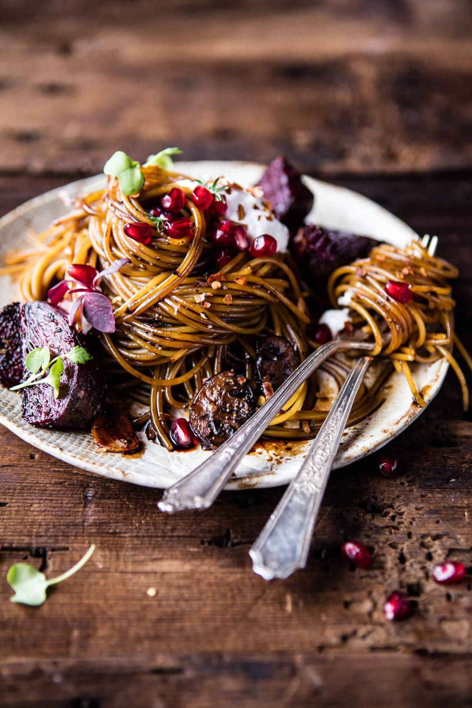

{width=100%}

**Prep Time:** 10 min | **Cook Time:** 20 min | **Total Time:** 30 min

## Ingredients

- 4 tablespoons olive oil
- 4  medium red beets, quartered
- 1 tablespoon chopped fresh thyme
- kosher salt and pepper
- 1 pound long cut pasta, such as spaghetti
- 2 tablespoons butter
- 8 ounces cremini mushrooms, sliced
- 4 cloves garlic, thinly sliced
- 1 cup balsamic vinegar
- 2-3 tablespoons honey
- 1/2 teaspoon crushed red pepper flakes
- 1/2 cup crumbled goat cheese or whipped goat cheese
- pomegranate arils, for serving (optional)

## Instructions

1. Preheat the oven to 425 degrees F.
1. On a baking sheet, toss together 2 tablespoons olive oil, the beets, thyme, and a good pinch of salt + pepper. Transfer to the oven and roast for 25-30 minutes or until the beets are tender and lightly charred.
1. Meanwhile, bring a large pot of salted water to a boil. Boil the pasta until al dente according to package directions. Just before draining, reserve 1 cup of the pasta cooking water. Drain.
1. Melt the butter and 2 tablespoons olive oil in a large skillet over high heat. Add the mushrooms and cook until they just begin to caramelize on the edges, about 5 minutes. Add the garlic and cook 30 seconds to 1 minute or until fragrant. Remove the mushrooms and garlic from the skillet and place on a plate. To the same skillet, add the balsamic vinegar, honey and crushed red pepper flakes. Bring to a boil over medium high heat and cook for 5-8 minutes or until the balsamic reduces by about 1/3 and is sticky to touch. Reduce the heat to low and stir in the pasta and mushrooms. Toss to coat, if the sauce seems too thick, thin it with a little of the pasta cooking water. Season to taste with salt and pepper.
1. Serve the pasta immediately, topped with roasted beets, goat cheese, and pomegranate arils (if using). Eat!

