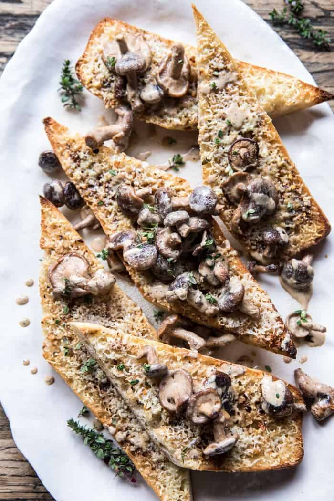

{width=100%}

**Prep Time:** 15 min | **Cook Time:** 30 min | **Total Time:** 45 min

## Ingredients

- 1 stick (1/2 cup)  salted butter
- 4-6 cloves garlic
- 2 teaspoons chopped fresh oregano
- 1/2 teaspoon crushed red pepper flakes
- 1  sourdough baguette, halved lengthwise and cut in 6 pieces
- 1 cup grated parmesan cheese
- 1 tablespoon extra virgin olive oil
- 1 pound mixed mushrooms
- 2 teaspoons chopped fresh thyme, plus more for serving
- kosher salt and pepper
- 1/4 cup white wine
- 1/4 cup buttermilk
- 1/4 cup heavy cream

## Instructions

1. Preheat the oven to 425 degrees F.
1. In a large skillet, combine the butter, garlic, and oregano. Cook over medium low heat, stirring often until the garlic is golden and caramelized, about 15 minutes. The butter will brown slightly. Remove from the heat and finely mash the garlic with a fork. Stir in the crushed red pepper flakes.
1. Arrange the bread on a baking sheet. Drizzle/rub the garlic butter onto each cut side of bread. Top with cheese and transfer to the oven for 8-10 minutes or until the cheese has melted.
1. Meanwhile, return the skillet to medium heat and add the olive oil. When the oil shimmers, add the mushrooms. Cooking, undistributed until the mushrooms are golden on the bottom, about 3-5 minutes, stir and add the thyme and a pinch each of salt and pepper. Reduce the heat to low, add the wine, buttermilk, and cream. Cook until warmed though, about 5 minutes. Remove from the heat and season as needed with salt and pepper.
1. Arrange the garlic bread on a serving plate and spoon the mushrooms over top. Alternately, you can serve the garlic bread alongside the mushrooms for dipping/spoon over the bread. Top with thyme. EAT!

