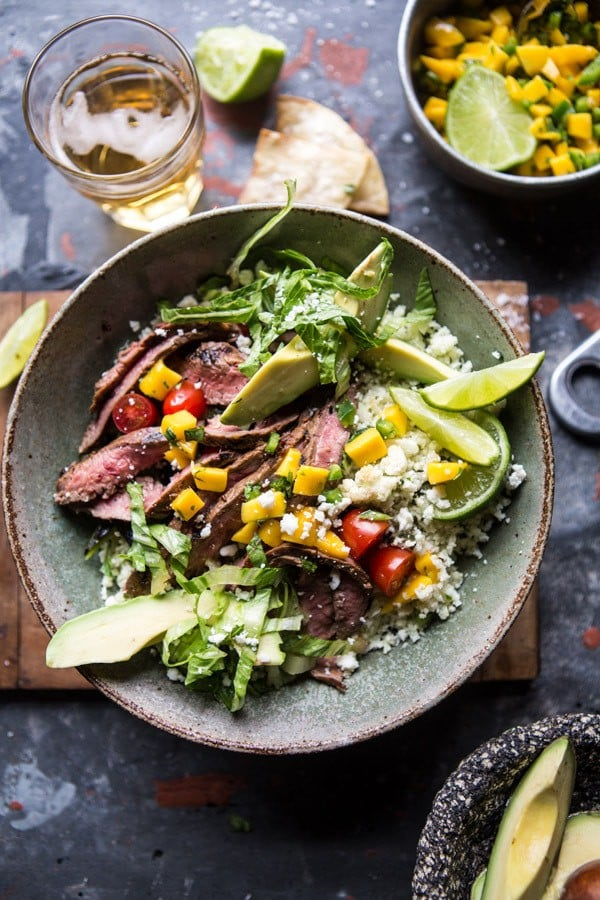

{width=100%}

**Prep Time:** 15 min | **Cook Time:** 15 min | **Total Time:** 1 hr

## Ingredients

- 1 1/2 pounds flank steak
- 1/4 cup olive oil
- 1/3 cup orange juice
- 4 cloves garlic, minced or grated
- 1  chipotle pepper in adobo, chopped ((or 2 teaspoons chili powder))
- zest and juice of 1 lime
- 1/2 cup fresh cilantro, chopped
- shredded lettuce, sliced avocado, and cheese, for serving
- 2 cups riced cauliflower ((about 1 large head pulsed in a food processor))
- 1 tablespoon olive oil
- 1 teaspoon cumin
- 1/4 cup fresh cilantro chopped
- 1  mango, chopped
- 1  jalapeño, seeded and chopped
- juice of 1 lime
- 1/4 cup fresh cilantro, chopped

## Instructions

1. Add the steak to a ziplock bag and add the olive oil, orange juice, garlic, chipotle peppers, lime zest and juice, and the cilantro. Seal the bag and marinate 30 minutes or in the fridge as long as overnight.
1. Meanwhile, make the cauliflower rice. Preheat the oven to 425 degrees F.
1. Spread the riced cauliflower out on a large baking sheet and toss together with the olive oil, cumin, and a large pinch of salt. Transfer to the oven and cook 10 minutes, toss and cook 10 minutes more or until the cauliflower is tender. Remove and stir in the cilantro and juice + zest of 1/2 a lime juice.
1. Preheat your grill or grill pan to high.
1. Remove the steak from its marinade and sear the steak for 5-8 minutes, flip and sear another 5 minutes or until your desired doneness is reached. Remove the steak from the grill and allow to rest 10 minutes. Slice steak thinly against the grain.
1. To make the salsa. In a bowl, combine the mango, jalapeño, lime juice, cilantro, and a pinch of salt.
1. To serve, divide the rice among bowls and top with steak, lettuce, avocado, salsa, and cheese, EAT!

