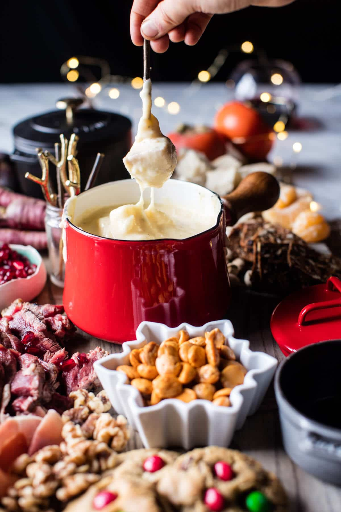

{width=100%}

**Prep Time:** 15 min | **Cook Time:** 15 min | **Total Time:** 30 min

## Ingredients

- 3 cups shredded swiss cheese
- 3 cups shredded gruyere cheese
- 2 tablespoons cornstarch
- 1 clove garlic
- 1 cup white wine (may use chicken broth)
- pinch of freshly grated nutmeg
- kosher salt + pepper
- 3 cups shredded cheddar
- 3 cups shredded aged gouda
- 2 tablespoons cornstarch
- 1 clove garlic
- 1 cup beer (may use chicken broth)
- 1/4 teaspoon mustard powder
- 4 ounces crumbled blue cheese (optional)
- kosher salt + pepper
- assorted crackers and breads
- assort winter fruits and vegetables
- thinly sliced grilled steak and or assorted deli meats
- honey and or honeycomb
- toasted nuts (I love marcona almonds (walnuts, and pistachios))

## Instructions

1. 

