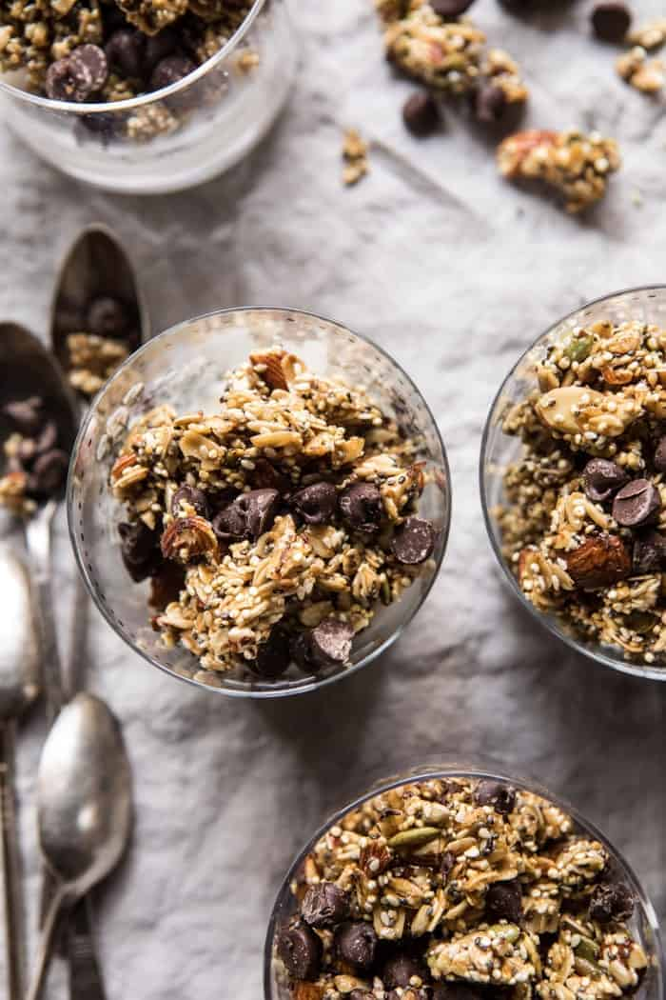

{width=100%}

**Prep Time:** 15 min | **Cook Time:** 30 min | **Total Time:** 45 min

## Ingredients

- 1 cup old fashioned oats
- 1/2 cup cooked quinoa
- 1 cup raw almonds, roughly chopped
- 1/2 cup raw sunflower seeds
- 1/4 cup raw pumpkin seeds
- 1/4 cup raw sesame seeds
- 1/4 cup chia seeds
- 4 tablespoons salted butter
- 1/2 cup + 2 tablespoons honey
- 2 teaspoons vanilla extract
- 1 cup semi-sweet or dark chocolate chips

## Instructions

1. Preheat the oven to 275 degrees F. Line a baking sheet with parchment paper.
1. In a large bowl combine the oats, quinoa, almonds, sunflower seeds, pumpkin seeds, sesame seeds, and chia seeds.
1. Melt together the butter and 1/2 cup honey. Stir in the vanilla. Pour the mixture over the oatmeal mix and toss well to combine. Spread in an even layer on the prepared baking sheet. Transfer to the oven and bake 20 minutes. Remove from the oven, stir, and drizzle the remaining 2 tablespoon honey over the granola. Return to the oven and bake another 10 -15 minutes until golden. Remove from the oven and let cool 15-20 minutes. Stir in the chocolate chips. Keep stored in an airtight container for up 1 month.

