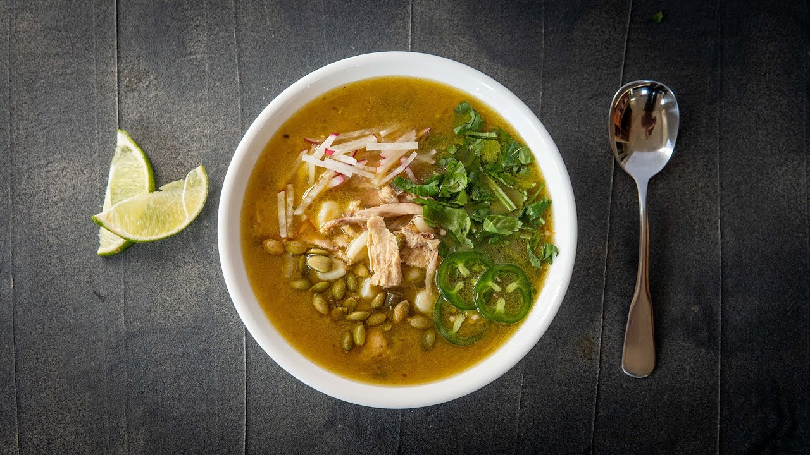

{width=100%}

**Prep Time:**  | **Cook Time:**  | **Total Time:** 1 hr 30 min

## Ingredients

- Tomatillos, 12-15
- Poblano peppers, 3-4
- Ghost pepper, 1
- Serrano peppers, 2
- Yellow onion, 1
- Garlic, 6 cloves
- Whole Chicken, 1
- chicken stock, 1800 g
- hominy, 850 g
- Cumin, 3 g
- Ground coriander, 2 g
- Chili Powder, 2 g
- Salt, 
- Black Pepper, 
- Pickled onions, 
- Jalapeños, 
- Crema, 
- Radishes, thinly sliced
- Cilantro, 
- Cotija cheese, 
- Limes, 
- Pepitas, 

## Instructions

- Turn the oven on broil at 500° F/260° C.
- Spread tomatillos, poblano and serrano peppers on a large tin foil rimmed baking sheet. Broil for 5 minutes until blackened and charred. Let cool 10 minutes.
- Meanwhile, finely chop the yellow onion and garlic cloves. Add them to a bowl.
- Once cooled, finely chop the roasted tomatillos, poblanos, and serrano peppers and add them to the bowl.
- Cut the whole chicken into 10 pieces.
- If you haven’t broken down a chicken yet, check out the video for how I do this.
- Next, heat a thin layer of vegetable oil in a large Dutch oven over medium-high heat.
- Liberally season the chicken pieces with salt and pepper.
- Add them to the Dutch oven to sear and brown on all sides. Set the browned chicken pieces on a plate and turn the heat to medium-low.
- To the same pot that the chicken was browned in, add the bowl of chopped vegetables, ground spices, and a pinch of salt to the pot. Sauté, stirring occasionally, for 10-15 minutes.
- Set the heat to low and sauté for another 15-20 minutes until everything is caramelized and reduced.
- Pour in the chicken stock and deglaze the pot.
- Add the browned chicken pieces. Bring the soup to a simmer and cook, uncovered, for 20-30 minutes.
- Remove the chicken pieces and shred them, picking out any bones or inedible pieces. Return the shredded chicken to the soup and add the hominy.
- Taste it and add salt and pepper as needed.
- Serve in bowls and top with pickled red onion, sliced jalapeño, crema, radish, cilantro, cotija, fresh squeezed lime, or any other desired toppings.

