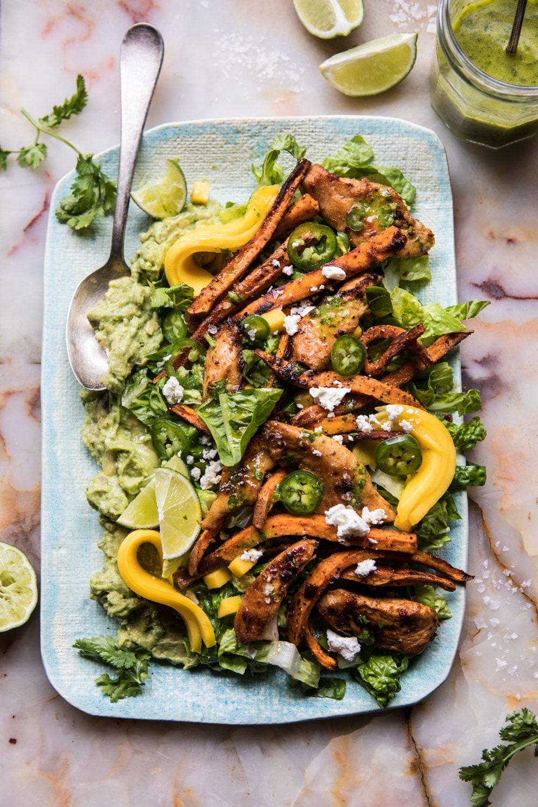

{width=100%}

**Prep Time:** 15 min | **Cook Time:** 30 min | **Total Time:** 45 min

## Ingredients

- 1 pound boneless chicken breasts, cut into strips
- 4 tablespoons extra virgin olive oil
- 2  chipotle peppers in adobo, chopped
- 1 tablespoon honey
- 1 teaspoon cumin
- 2  limes
- 2 cloves garlic, minced or grated
- kosher salt and pepper
- 2  sweet potatoes, cut into matchsticks
- 2  avocados, lightly mashed
- 3 heads romaine lettuce chopped
- 1  mango, diced
- 8 ounces feta, crumbled
- 1/3 cup extra virgin olive oil
- 1/3 cup fresh orange juice
- 2 tablespoons lime juice
- 1/2 cup fresh cilantro
- 1  jalapeño, halved and seeded if desired
- kosher salt and pepper

## Instructions

1. Preheat the oven to 425 degrees F.
1. On a rimmed baking sheet, combine the chicken, 2 tablespoons olive oil, chipotle, honey, cumin, juice and zest of 1 lime, garlic and a large pinch of both salt and pepper. Toss well to evenly coat the chicken.
1. On a separate baking sheet, toss together the sweet potatoes and remaining 2 tablespoons olive oil, plus a pinch of both salt and pepper. Roast both the chicken and potatoes for 25-30 minutes, tossing halfway through cooking until the chicken is cooked throughout and the potatoes tender.
1. In a medium bowl, stir together the avocados, remaining lime juice and a pinch of salt.
1. In a large salad bowl, toss together the lettuce, mango, feta, fries, and chicken. Dollop the avocado over the salad. Drizzle with vinaigrette (recipe follows).
1. Add all ingredients to a blender and blend until combined. Taste and adjust seasonings as needed. The vinaigrette can be made a few days in advance and kept in the fridge.

