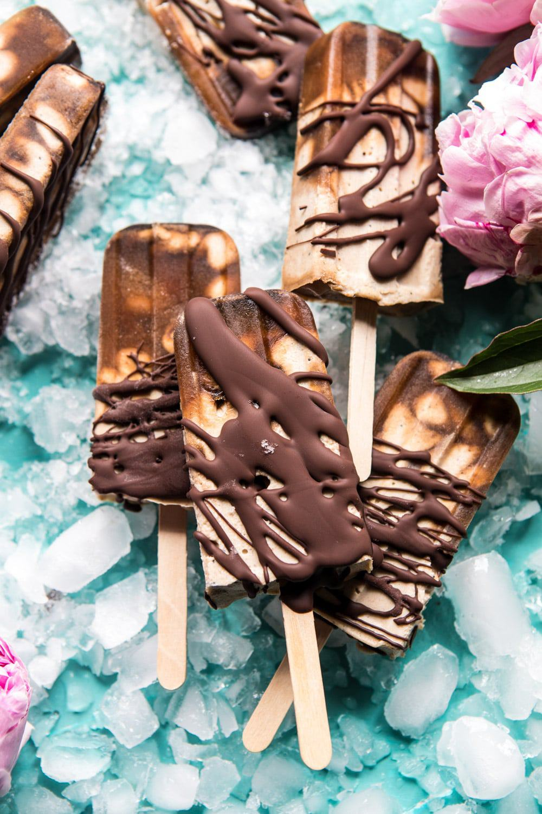

{width=100%}

**Prep Time:** 20 min | **Cook Time:**  | **Total Time:** 6 hr 20 min

## Ingredients

- 1 cup raw cashews
- 1 1/2 cups full fat canned coconut milk
- 1/2 cup pitted medjool dates
- 2 teaspoons vanilla extract
- 1 pinch flaky sea salt
- 6 tablespoons brewed coffee
- 8 ounces dark chocolate, melted

## Instructions

1. Bring a small pot of water to a boil. Add the cashews and let sit 15 minutes or up to 2 hours. Drain.
1. In a high power blender or food processor, combine the cashews, coconut milk, dates, vanilla, pinch of salt and 2 tablespoons coffee. Blend until completely smooth and the consistency of a thick smoothie.
1. Evenly divide the remaining coffee among 7-8 popsicle molds. Spoon the cashew mix over the coffee, it should naturally create a swirl of coffee. Insert popsicle sticks, cover the tops of the mold, and freeze until firm, about 4 hours. To remove the popsicles run the mold under hot water for 10 seconds and then pull the popsicles out of the molds.
1. Dip each popsicle in chocolate. Store in the freezer.

