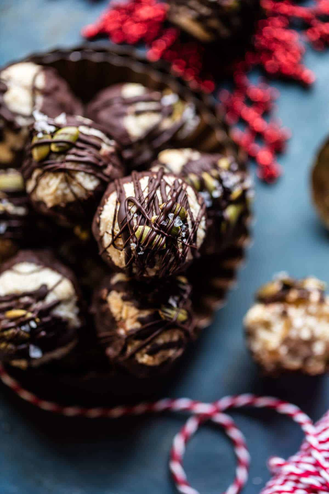

{width=100%}

**Prep Time:** 15 min | **Cook Time:** 15 min | **Total Time:** 

## Ingredients

- 2 tablespoons Bob’s Red Mill Pumpkin Seeds
- 3/4 cup maple syrup
- 1/4 cup full fat canned coconut milk
- 1 tablespoon coconut oil
- 2 teaspoons vanilla extract
- pinch of flaky sea salt
- 3 cups Bob’s Red Mill Flaked Coconut
- 1/2 cup Bob’s Red Mill Almond Flour
- 5 ounces dark chocolate (melted)

## Instructions

1. Preheat the oven to 350 degrees F. Line two baking sheets with parchment paper.
1. Add the pumpkin seeds to a prepared baking sheet and place in the oven for 5-8 minutes or until lightly toasted. Set aside.
1. To make the caramel - In a small saucepan set over medium heat, combine the maple syrup, coconut milk and coconut oil. Bring the mixture to a boil, stirring continuously, for 10 minutes or until the mixture has thickened slightly and reduced to ¾ cup. The caramel should be easily pourable. Remove from the heat and stir in the vanilla and a pinch of salt.
1. To the bowl of a food processor, add the coconut, almond flour, and all but 1/4 cup of the caramel (reserve the 1/4 cup caramel for topping). Pulse until the mix is finely chopped and holds together when squeezed into a ball.
1. Drop 1 tablespoon size balls of the mixture onto the prepared baking sheet. Make sure the balls are packed tight; if needed, use your hands to finely pack the balls together. Transfer to the oven and bake for 8-10 minutes or until the tops of the macaroons just begin to appear toasted. Remove from the oven and let cool completely.
1. Add half the chocolate to a microwave-safe bowl and microwave on thirty second intervals, stirring after each interval until melted and smooth. Remove from the microwave and stir in the remaining chocolate until smooth.
1. Gently dip the bottom of each macaroon into the melted chocolate and place on a parchment lined baking sheet. Drizzle with any remaining chocolate and then sprinkle with toasted pumpkin seeds. Place in the fridge to firm up. Once the chocolate has set, serve cold or at room temperature, and drizzle with the remaining caramel sauce. If desired, sprinkle with a bit more flaky sea salt!

