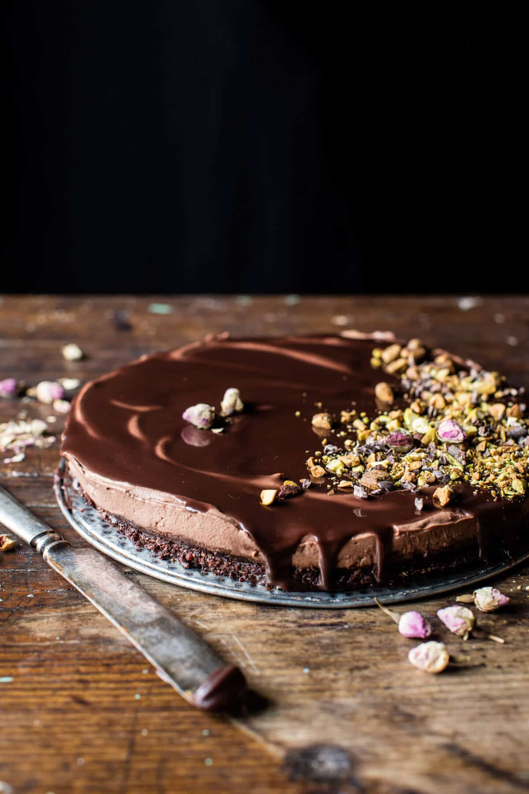

{width=100%}

**Prep Time:** 10 min | **Cook Time:** 3 min | **Total Time:** 1 hr 43 min

## Ingredients

- 1 cup raw walnuts
- 1/2 cup raw (unsweetened coconut flakes)
- 1 1/2 cups pitted (packed dates (about 10 ounces))
- 1/2 cup cacao powder or unsweetened cocoa powder
- pinch of flaky sea salt
- 1 cup heavy cream
- 1 1/2 cups plain whole milk greek yogurt
- 1/2 cup cacao powder or unsweetened cocoa powder
- 1-2 tablespoons honey
- 2 teaspoons vanilla
- 3/4 cup full-fat canned coconut milk or heavy cream
- 5 ounces dark chocolate (chopped)
- chopped pistachios (for topping (optional)

## Instructions

1. To make the crust. In a food processor, combine the walnuts, coconut, dates, cacao powder, and a pinch of salt. Pulse until finely ground and the mix forms a ball, about 5 minutes. Press the mixture into the bottom of an 8-9 inch spring form pan, making sure to pack it in tightly.
1. To make the mousse. Add the heavy cream to the bowl of a stand mixer fitted with the whisk attachment or use a hand held mixer. Whisk the cream until stiff peaks form. Using a spatula, gently fold the greek yogurt into the whipped cream. Add the cacao powder, honey, and vanilla and stir until combined and creamy. Spread the mousse evenly over top the brownie layer. Cover and place in the fridge for 1 1/2 hours
1. In a microwave safe bowl, combine the coconut milk and dark chocolate. Microwave on power lever high for 30 second intervals, stirring after each until melted and smooth. Let cool five minutes, then pour the ganache over top the mouse. Sprinkle with pistachios. Chill 30 minutes or until ready serve.
1. Run a knife around the inside of the spring form pan and then release the cake from the pan. slice and serve!

