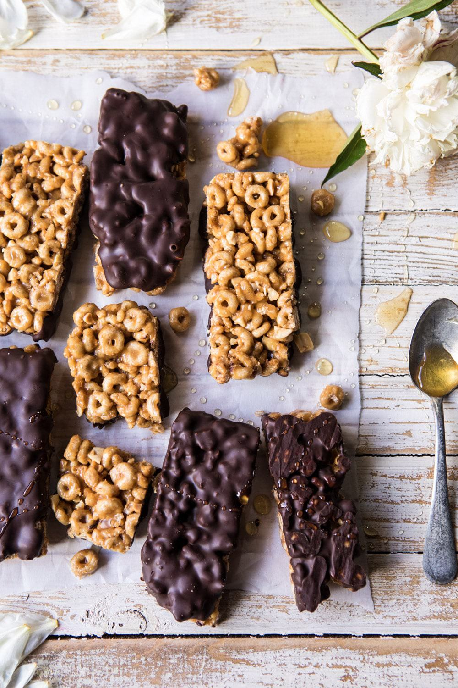

{width=100%}

**Prep Time:** 15 min | **Cook Time:**  | **Total Time:** 15 min

## Ingredients

- 1/2 cup honey
- 1/2 cup creamy peanut butter
- 3 cups Cheerios cereal
- 1 cup Brown Rice Krispies
- 1/2 cup roasted peanuts, chopped
- 8-12 ounces semi-sweet or dark chocolate, melted

## Instructions

1. Line a 9x13 inch baking pan with parchment paper.
1. In a large, microwave safe bowl, melt together the honey and peanut butter until smooth, about 30 second to 1 minute. Stir in the Cheerios, Brown Rice Krispies, and peanuts, tossing well to combine. Spread the mix out into the prepared pan, packing it in tightly. Transfer to the freezer and freeze 15-20 minutes.
1. Remove the pan from the freezer and cut into 16 bars. Working quickly, dip each bar in chocolate and place on a parchment lined baking sheet. Return to the freezer for 10 minutes. Keep stored in the fridge or freezer.

