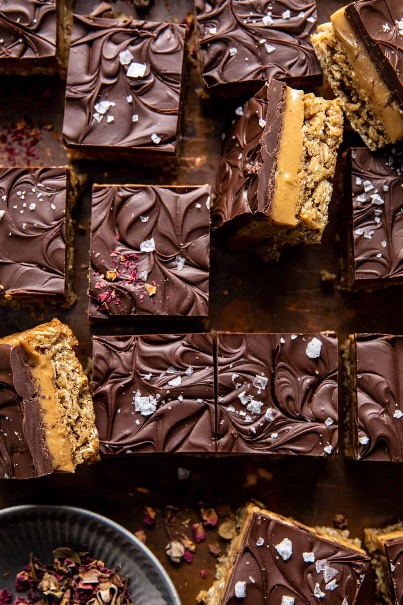

{width=100%}

**Prep Time:** 30 min | **Cook Time:** 30 min | **Total Time:** 2 hr

## Ingredients

- 2 1/2 cups old fashioned oats
- 2 cups almond flour
- 2 teaspoons baking soda
- 1 teaspoon kosher salt
- 3/4 cup melted coconut oil
- 1/2 cup pure maple syrup
- 2  large eggs
- 2 teaspoons vanilla extract
- 1 cup, plus 1/3 cup creamy peanut butter  ((just peanuts and salt))
- 1/4 cup pure maple syrup
- 1/4 cup melted coconut oil
- 12 ounces dark chocolate, chopped
- sea salt

## Instructions

1. Preheat the oven to 350° F. Line a 9x13 inch baking dish with parchment paper. 2. To make the cookies: In a mixing bowl, beat together the oats, almond flour, baking soda, salt, coconut oil, maple syrup, eggs, and vanilla. Press the dough into the prepared baking dish. Bake 25-30 minutes, until lightly golden.
1. To make the peanut butter mix: In a medium pot, mix 1 cup peanut butter, the maple syrup, and coconut oil. Bring to a gentle boil over medium heat, stirring constantly. Cook 2 minutes, then remove from the heat. Pour over the oatmeal cookies. Freeze 30 minutes, until firm.
1. Melt together the chocolate and 1/3 cup peanut butter in the microwave. Let cool 5 minutes and then spread the chocolate over the peanut butter mix. Return to the fridge to set, about 10 minutes, then slice. The chocolate will not be totally set, but slicing is easier this way. Keep in the fridge.

