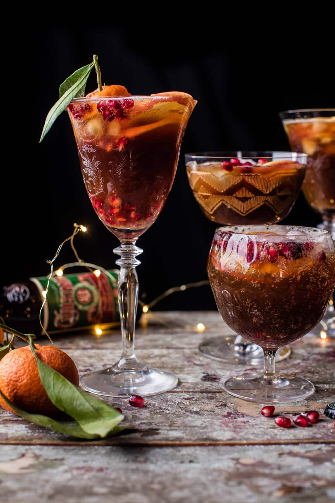

{width=100%}

**Prep Time:** 10 min | **Cook Time:**  | **Total Time:** 10 min

## Ingredients

- 1 1/2 cups apple cider
- 1/2 cup vodka
- 6  dashes orange bitters
- 2  pears (sliced)
- 3  oranges (sliced)
- arils from 1 pomegranate
- 1 cup cranberries
- 3  cinnamon sticks
- 5  bottles Christmas Ale (chilled)
- sparkling water (for topping (optional))

## Instructions

1. In a large pitcher, add the apple cider, vodka and orange bitters, stir to combine. Add the pears, oranges, pomegranate arils, and cranberries. Chill until ready to serve.
1. Before serving, slowly pour in the beer and gently stir to combine. Pour among glasses and top with sparkling water if desired.

