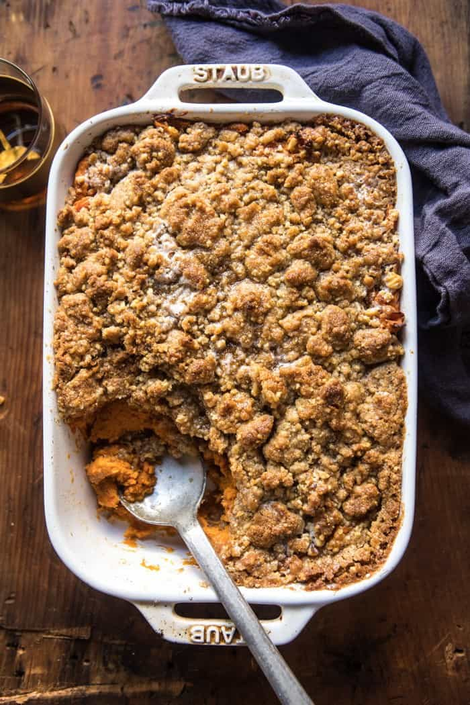

{width=100%}

**Prep Time:** 15 min | **Cook Time:** 1 hr | **Total Time:** 1 hr 15 min

## Ingredients

- 4 medium sweet potatoes
- 1/4 cup real maple syrup
- 2 teaspoons vanilla extract
- 1 teaspoon ground cinnamon
- 1/4 cup heavy cream
- 4 tablespoons salted butter, melted
- 2  eggs, lightly beaten
- 1/2 cup all-purpose flour
- 1/2 cup brown sugar, packed
- 1/2 cup real maple syrup
- 1 cup raw walnuts, finely chopped
- 1 teaspoon cinnamon
- 8 tablespoons cold butter, cubed

## Instructions

1. Preheat your oven to 400 degrees F. Grease a 9x13 inch baking dish or a dish slighly smaller (no less than 2 quarts).
1. Poke a few holes in the sweet potatoes and bake for 1 hour or until soft and tender. When the sweet potatoes are cooked, slice them in half and allow to cool. Reduce the oven temperature to 350 degrees F.
1. Peel the skins away from the sweet potatoes and mash well in a large mixing bowl. Mix in the maple syrup, vanilla, cinnamon, heavy cream, butter, and eggs, mixing until combined.
1. To make the streusel. In a medium bowl, combine the flour, brown sugar and cinnamon. Add 6 tablespoons butter and use your fingers to mix the butter into the flour until a crumble forms. Stir in 1/4 cup maple syrup and the walnuts.
1. Pour half the sweet potatoes into the prepared dish. Sprinkle with 1/3 of the streusel. Spread the remaining sweet potatoes over top and sprinkle the remaining streusel evenly over the top of the sweet potatoes. Transfer to the oven and bake for 30-40 minutes or until the top is dark golden.
1. Meanwhile, in a small sauce pan, brown the remaining 2 tablespoons butter over medium heat. Stir in the remaining maple syrup.
1. Just before serving, drizzle the browned maple butter over the casserole. Serve warm.

