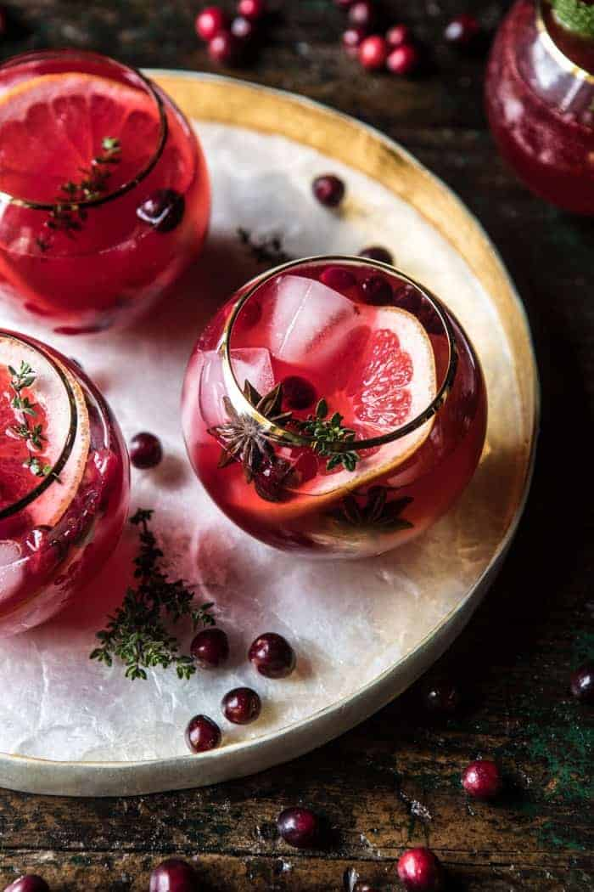

{width=100%}

**Prep Time:** 10 min | **Cook Time:** 10 min | **Total Time:** 20 min

## Ingredients

- 1/2 cup honey
- 2 cups fresh cranberries
- 2 sprigs fresh thyme
- 1 inch fresh ginger, sliced
- 8 ounces vodka
- 4 ounces elderflower liquor
- 1/3 cup fresh squeezed grapefruit juice, plus slices for serving
- 1/4 cup fresh lime juice
- 4-6  ginger beers
- star anise, for serving  ((optional))

## Instructions

1. In a medium pot, bring 1/2 cup water, the honey, cranberries, thyme, and ginger to a boil over high heat. Boil 5 minutes or until the cranberries begin to burst, then remove from the heat. Let cool. Remove the thyme and ginger. If desired, strain out the cranberries.
1. In a large pitcher, combine the cranberry syrup mix, vodka, elderflower liquor, grapefruit juice, and lime juice. Chill until ready to serve.
1. Add the ginger beer just before serving. Garnish each drink with a grapefruit slice and star anise, if desired.

