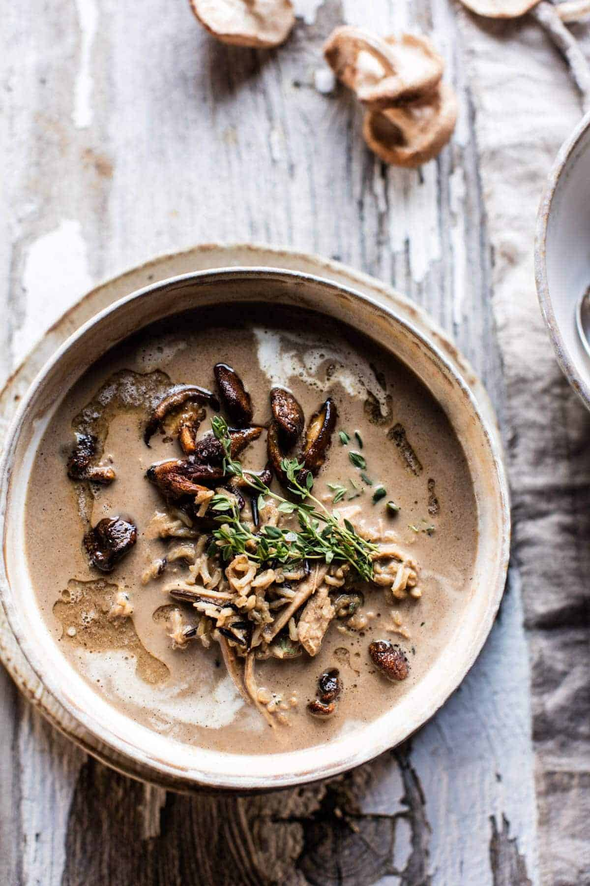

{width=100%}

**Prep Time:** 15 min | **Cook Time:** 45 min | **Total Time:** 1 hr

## Ingredients

- 2 tablespoons butter
- 1 tablespoon olive oil
- 4 cloves garlic (smashed)
- 1/2  sweet onion (chopped)
- kosher salt and pepper
- 6 ounces cremini mushrooms
- 2 ounces wild mushrooms
- 1 tablespoon fresh chopped thyme
- 6 cups low sodium chicken broth
- 1 cup wild rice
- 1/2-1 pound boneless (skinless chicken breasts or tenders)
- 1 cup whole milk
- 1/2 cup grated parmesan

## Instructions

1. Melt the butter and olive oil in a large, heavy bottomed soup pot over medium heat. Add the garlic and onion and cook for 5-8 minutes, stirring often until the onion is soft. Season with salt and pepper. Add the cremini mushrooms and the wild mushrooms, cook another 5 minutes or until the mushrooms are caramelized. Stir in the thyme and cook another minute longer. Remove the pot from the heat and ladle out half of the wild mushrooms. Transfer the remaining ingredients to a food processor. Add 2 cups broth and pulse until smooth, about 2 minutes.
1. Return the mixture to the soup pot and add the remaining 4 cups broth plus 2 cups water. Bring the mixture to boil and stir in the rice and chicken. Cover and reduce the heat to medium low. Simmer for 30 minutes or until the rice is tender and the chicken has cooked through. Shred the chicken in the pot. Stir in the milk and parmesan. Season the soup with salt + pepper. Simmer the soup for 5-10 minutes until warmed through.
1. Ladle the soup into bowls. Top with the reserved wild mushrooms (warm them if needed). Enjoy!

