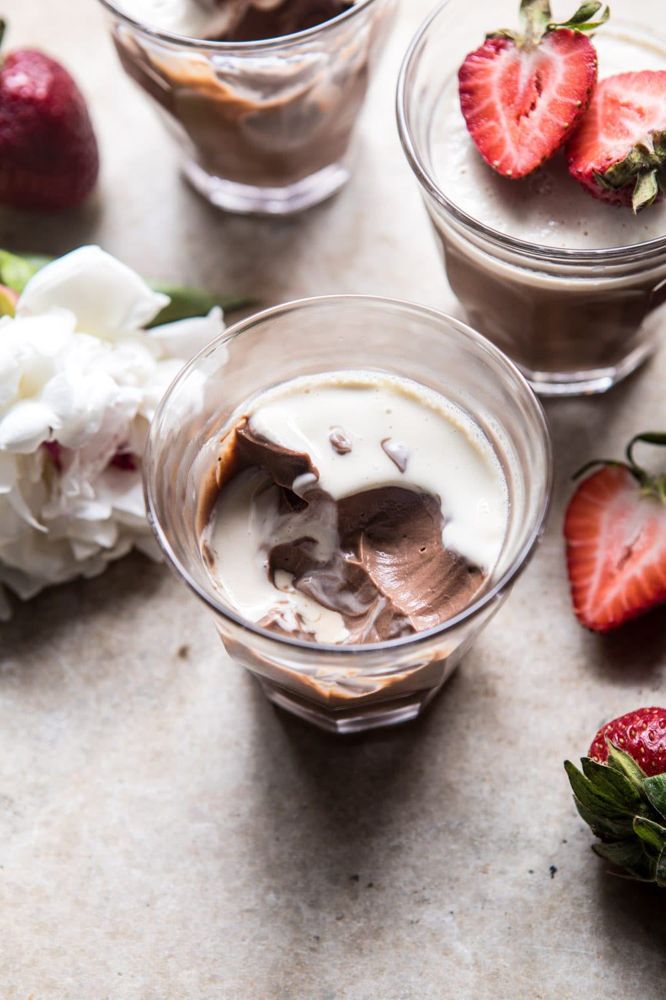

{width=100%}

**Prep Time:** 10 min | **Cook Time:** 10 min | **Total Time:** 20 min

## Ingredients

- 3  egg yolks
- 1/2 cup honey
- 3 1/2 cups heavy cream
- pinch of sea salt
- 1/4 cup brewed black coffee
- 1 tablespoon vanilla extract
- 10 ounces semi-sweet or dark chocolate, chopped

## Instructions

1. In a large pot, whisk together the egg yolks and honey. Add the cream and sea salt. Set the pot over medium-high heat and bring the mixture to a boil. Cook, stirring continuously, until the mixture thickens and easily coats the back of a wooden spoon, 5-8 minutes. Watch close, milk tends to boil over. Remove from the heat. Stir in the coffee and vanilla.
1. Remove 3/4 cup of the vanilla custard and set aside.
1. Add the chocolate to the remaining custard and stir until melted and smooth.
1. Divide the chocolate custard among six glasses. Freeze 1 hour and then evenly pour over the reserved vanilla custard. Freeze until set, about 2 hours. Keep in the fridge or freezer. If frozen, let sit at room temp for 10 minutes before serving. If kept in the fridge the vanilla custard will be runny.

