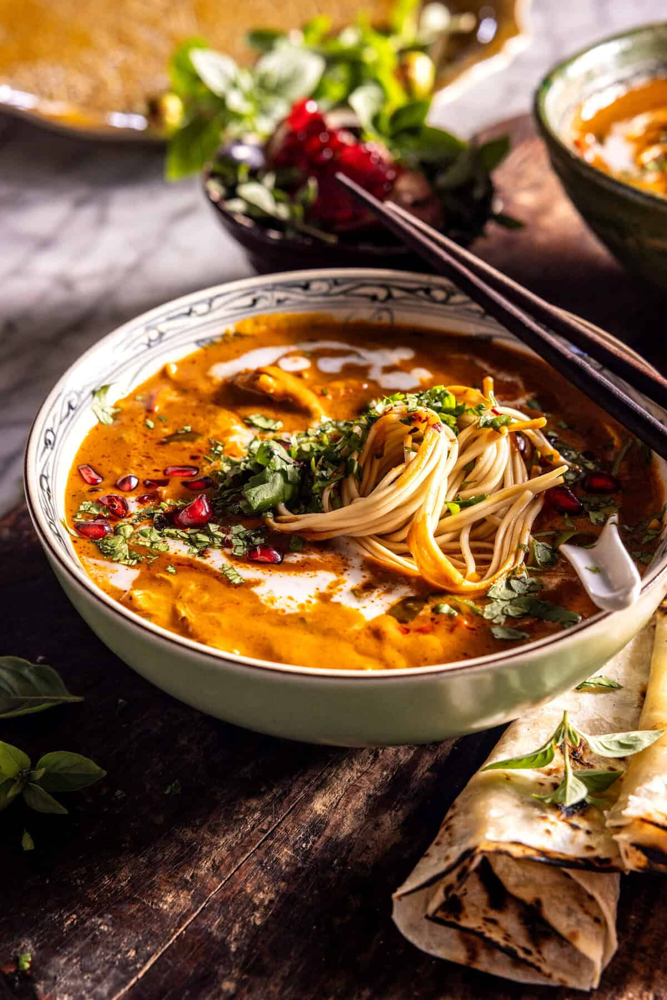

{width=100%}

**Prep Time:** 15 min | **Cook Time:** 25 min | **Total Time:** 40 min

## Ingredients

- 2 tablespoons salted butter
- 2  shallots, chopped
- 4 cloves garlic, chopped
- 1 teaspoon ground ginger
- 1/2 cup fresh Thai basil or cilantro, chopped
- 3-4 tablespoons Thai red curry paste
- 1 pound chicken thighs or breasts
- 1  red bell pepper, chopped
- 2 cups broth
- 1 can (2 cups) coconut milk
- 1 can (1 1/2 cups) pumpkin puree
- 2 tablespoons creamy peanut butter
- 1/4 cup tamari/soy sauce
- 1 pound rice or egg noodles
- pomegranate arils, for serving

## Instructions

1. In a Dutch oven, over high heat, melt the butter with the shallots, garlic, ginger, basil leaves, and curry paste. Cook until the curry paste has thickened, about 5 minutes. Add the chicken and bell pepper, and toss in the curry.
1. Pour over the broth, cover, and simmer 15 minutes, until the chicken is cooked through. Shred the chicken in the pot.
1. Add the coconut milk, pumpkin, tamari/soy sauce, and peanut butter. Cook for another 5 or so minutes, until warmed through.
1. Cook the noodles according to package directions.
1. Divide the noodles between bowls and ladle the soup over. Top as desired with extra coconut milk, cilantro, and pomegranate.

