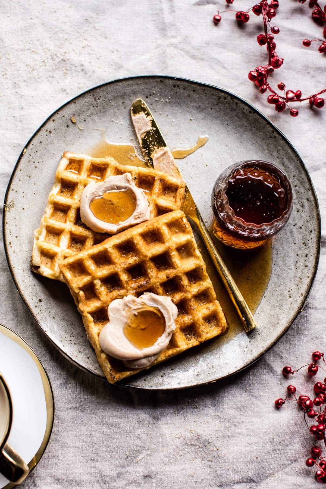

{width=100%}

**Prep Time:** 15 min | **Cook Time:** 5 min | **Total Time:** 20 min

## Ingredients

- 3/4 cup all-purpose flour
- 1/4 cup cornstarch
- 1/2 teaspoon salt
- 1/2 teaspoon baking powder
- 1/2 teaspoon baking soda
- 3/4 cup shaken buttermilk
- 1/4 cup water
- 1  large egg (separated)
- 6 tablespoons unsalted butter (melted and cooled)
- 1 teaspoon vanilla extract
- 3 tablespoons granulated sugar
- whipped cream and fresh fruit (for serving)
- 8 tablespoon butter (softened)
- 2 tablespoons maple syrup
- 1/2 teaspoon cinnamon
- 1/4 teaspoon nutmeg
- 1/8 teaspoon cloves

## Instructions

1. In a large bowl, whisk together the flour, cornstarch, salt, baking powder, and baking soda.
1. In a large measuring cup, whisk together the buttermilk, water, egg yolk, butter, and vanilla. Pour into the flour mixture and stir until just combined. Set aside.
1. In another bowl, with an electric mixer on high speed, beat the egg white until foamy. Add the sugar and beat until stiff, glossy peaks form. Fold into the reserved batter until just combined.
1. Cook the batter according to your waffle iron's instructions.
1. Top with the whipped eggnog butter, maple syrup, and fruit (if using).

