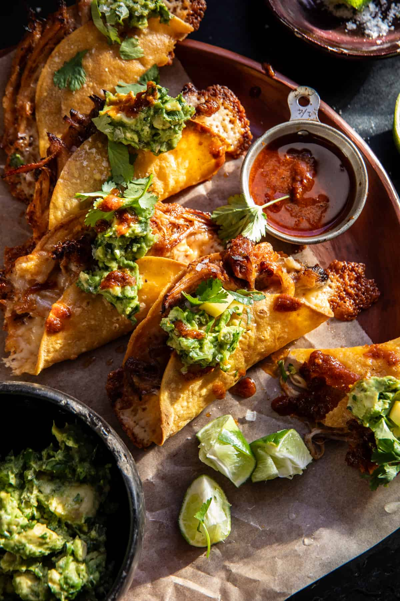

{width=100%}

**Prep Time:** 25 min | **Cook Time:** 3 hr | **Total Time:** 3 hr 25 min

## Ingredients

- 2-3 pounds pork butt, or 6 chicken thighs/breasts
- 2-3  chipotle peppers in adobo, chopped
- 1 tablespoon garlic powder
- 1 tablespoon onion powder
- 1 teaspoon smoked paprika
- 1 teaspoon ground cumin
- 1 teaspoon dried oregano
- 2 teaspoons salt
- 1/2 cup fresh orange juice
- 1/4 cup fresh lime juice
- 1 cup red enchilada sauce
- 12  hard shell tacos ((see notes for homemade))
- 2 cups shredded Mexican cheese
- 1-2  jalapeño peppers
- 2  avocados, diced
- 1/3 cup fresh chopped cilantro
- 2 tablespoons lime juice

## Instructions

1. Preheat the oven to 325° F.
1. Arrange the pork in a large, oven-safe Dutch oven. Add the chipotle chiles, garlic powder, onion powder, paprika, cumin, oregano, and salt. Rub the roast all over with the spices. Pour over the orange juice, lime juice, enchilada sauce, and 1 cup water. Cover and roast for 2 1/2 to 3 hours or until very tender.
1. Crank the heat on the oven up to 425° F. Uncover and cook for 10 minutes, until deeply caramelized on top. Remove the meat from the pot and shred it.
1. Line the unfilled taco shells up in a 9×13 inch baking dish. Transfer to the oven and bake for 5 minutes. Stuff the pork into each taco shell and top with cheese. Bake for 10 minutes, until the cheese has melted.
1. Meanwhile, roast the jalapeños alongside the tacos or char them over an open flame using a gas burner. Once charred, remove some of the charred skin, and if desired, de-seed, then chop. Mix the jalapeños with the avocado, cilantro, and lime - season with salt and lightly mash.
1. Serve the tacos topped with cilantro, avocado, and any braising liquid left in the pan. I also love to serve with mango salsa.

