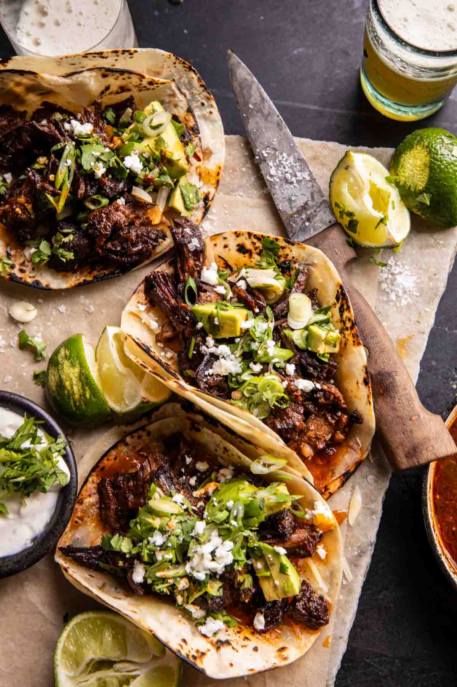

{width=100%}

**Prep Time:** 15 min | **Cook Time:** 3 hr | **Total Time:** 3 hr 15 min

## Ingredients

- 2  yellow onions, sliced
- 2 tablespoons chili powder
- 1 tablespoon chipotle chile powder
- 1 tablespoon smoked paprika
- 1 tablespoon ground cumin
- 1 tablespoon garlic powder
- 1 tablespoon dried oregano
- 1 teaspoon pink Himalayan salt
- 1  (4 pound) chuck roast
- 1 cup fresh orange juice
- 1 tablespoon honey
- 1 cup salsa verde
- 12  hard or soft taco shells, warmed
- cilantro, green onion, avocado, and crumbled cotija cheese, for serving

## Instructions

1. 

