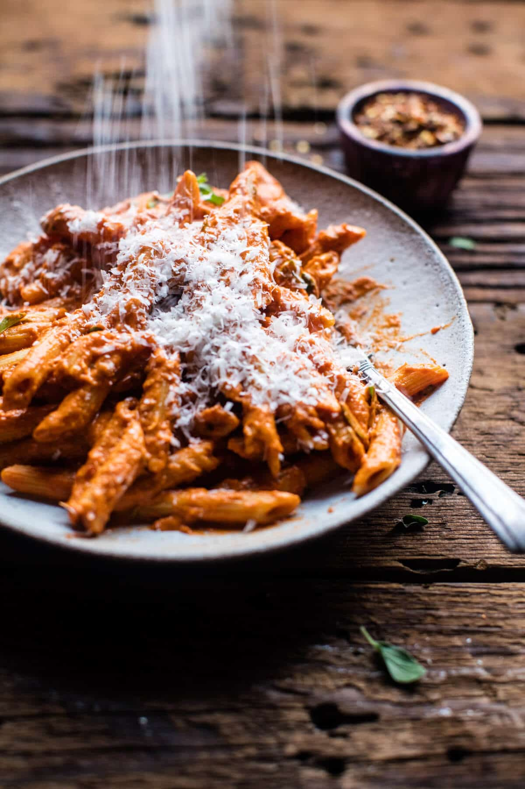

{width=100%}

**Prep Time:** 15 min | **Cook Time:** 6 hr | **Total Time:** 6 hr 15 min

## Ingredients

- 1/4 cup olive oil
- 1  sweet onion (diced)
- 4 cloves garlic (minced or grated)
- 1/2 teaspoon crushed red pepper flakes
- 1 1/2 teaspoons dried oregano
- 1 cup vodka
- 2 (28 ounce) cans whole tomatoes (I like San Marzano)
- 1/2 cup oil packed sun-dried tomatoes (drained (see note))
- kosher salt and pepper
- 1 cup heavy cream
- 1 cup grated parmesan cheese
- 1 pound penne pasta
- 4 tablespoons chopped fresh oregano

## Instructions

1. Heat the olive oil, onion, garlic, crushed red pepper, and dried oregano in a large skillet over medium low heat. Cook, stirring often until the onion is soft and the garlic fragrant, about 10 minutes. Add the vodka, raise the heat, and bring the mixture to a boil, boil 5 minutes. Remove from the heat and add to the bowl of your crockpot along with the tomatoes, sun-dried tomatoes and large pinch of salt + pepper. Cover and cook on low for 6-8 hours or on high for 4-5 hours. Transfer the sauce to a blender and puree until smooth. Return to the crockpot and stir in the the cream and the parmesan. Cook uncovered on high for 10 minutes.
1. Meanwhile, bring a large pot of salted water to a boil and boil the pasta until al dente according to package directions. Drain.
1. Divide the pasta among plates and top with the sauce, fresh oregano and grated parmesan. Eat!

