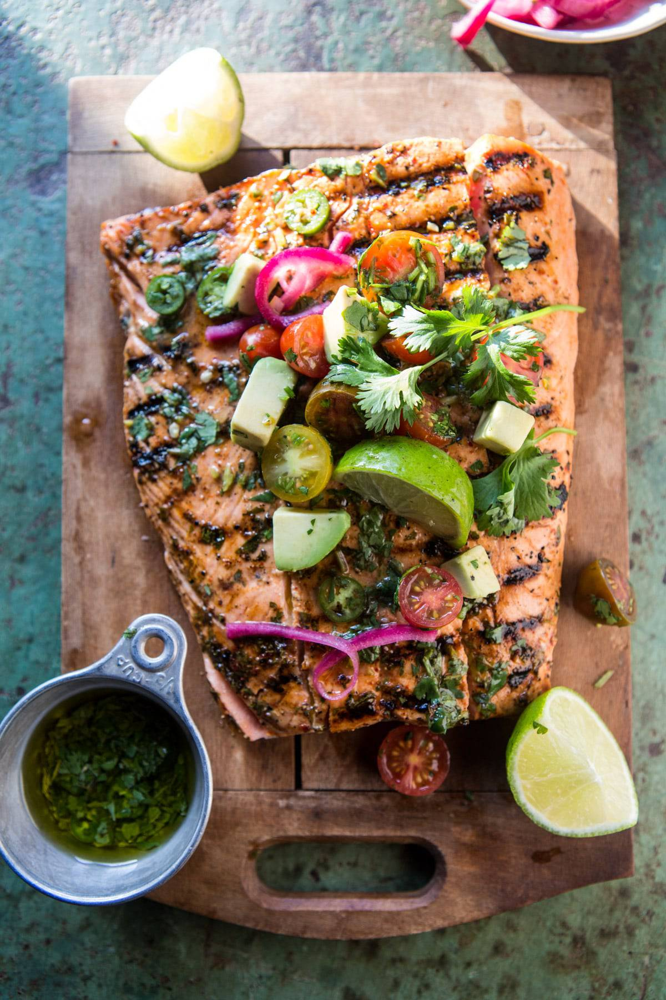

{width=100%}

**Prep Time:** 15 min | **Cook Time:** 10 min | **Total Time:** 25 min

## Ingredients

- 1 pound wild caught salmon
- 1/4 cup olive oil
- juice of 1 lime
- 1/4 cup freshly squeezed orange juice
- 3 cloves garlic
- 2  green onions
- 1 teaspoon cumin
- 1 teaspoon cayenne pepper
- 1 teaspoon kosher salt and pepper
- 1 tablespoon salted butter
- 2 cups cherry tomatoes, halved
- 2  ripe avocados, diced
- juice of 1 lime
- 1/4 cup fresh cilantro, chopped
- 1  jalapeño pepper, seeded and diced
- pinch of sea salt

## Instructions

1. Place the salmon in a 9x13 inch baking dish.
1. In a blender, combine the olive oil, lime juice, orange juice, garlic, green onions, cumin, cayenne, salt and pepper. Pulse until combined. Pour the marinade over the salmon and let set for 15 minutes.
1. Heat your grill, grill pan or skillet to medium high heat.
1. Transfer the salmon to the preheated grill and grill for about 3 minutes on each side or until the salmon is cooked to your desired doneness, brush the salmon with the marinade as it cooks. Remove the salmon from the grill.
1. To serve, pat the salmon with butter and allow it to melt. Serve topped with the tomato avocado salsa. Enjoy!

