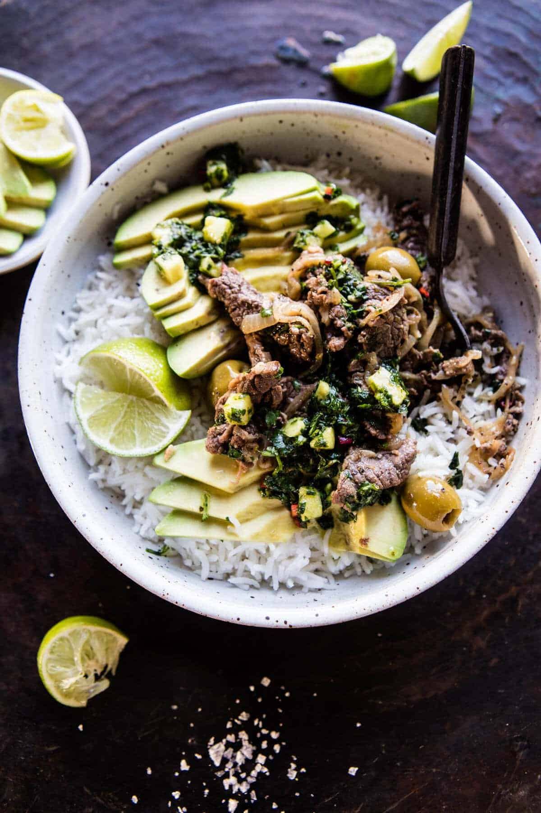

{width=100%}

**Prep Time:** 15 min | **Cook Time:** 15 min | **Total Time:** 1 hr

## Ingredients

- 1 1/4 cups fresh cilantro, chopped
- 1 cup diced pineapple
- 1  Fresno chile pepper, seeded + chopped
- 1  clove garlic, minced or grated
- 1/4 cup red wine vinegar
- 1/4 cup olive oil
- juice of 1 lime
- kosher salt and pepper
- 2 pounds skirt steak, thinly sliced
- 1/4 cup olive oil
- 8  cloves garlic, minced or grated
- 1/4 cup fresh oregano, chopped
- 2 teaspoons cumin
- 2  dried bay leaves
- juice from 2 limes
- 1 teaspoon kosher salt and pepper
- 2  sweet onions, thinly sliced
- 1/2 cup green olives
- 1  avocado, sliced
- steamed riced, for serving

## Instructions

1. 

