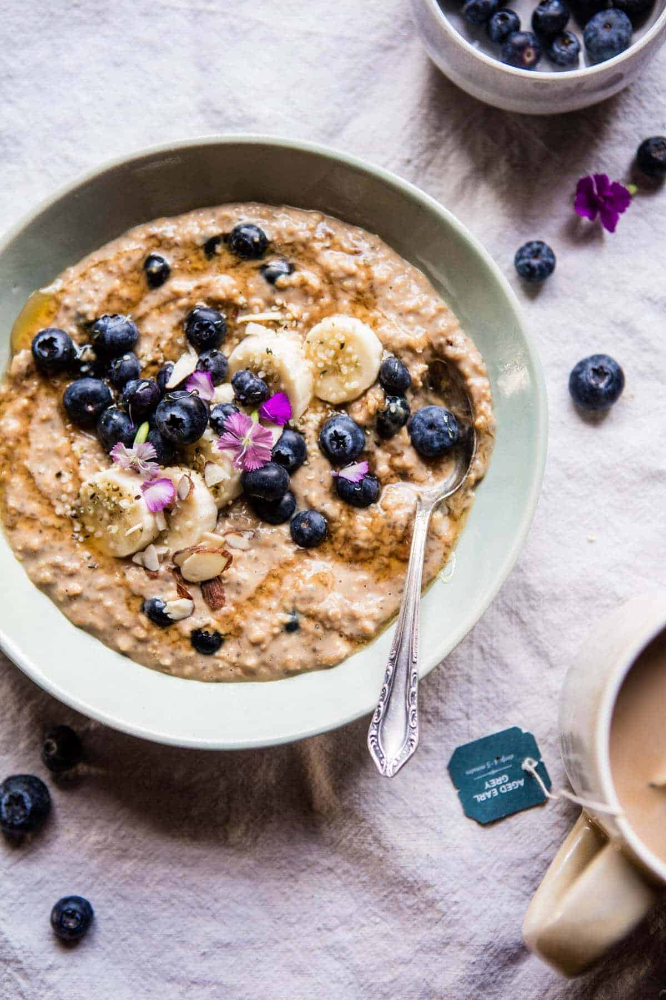

{width=100%}

**Prep Time:** 10 min | **Cook Time:** 5 min | **Total Time:** 15 min

## Ingredients

- 1/2 cup milk
- 1  earl grey tea bag
- 1 packet Pure Growth Organic Original Oatmeal
- 1/4 cup fresh blueberries, plus more for serving
- 1 tablespoon chia seeds
- 1 tablespoon honey
- 1/2 teaspoon vanilla extract
- pinch of flaky sea salt, to taste
- sliced banana, honey, and hemp seeds, for serving

## Instructions

1. Heat the milk in a small sauce pot until just scalding, remove from the heat, add the tea bag, cover and steep for 10 minutes. Remove the tea bag and stir in the oatmeal and blueberries. If the milk is not warm enough to cook the oats, gently heat the mix on the stove and stir until thickened, if needed add water to thin slightly.
1. Stir in the chia seeds, honey, vanilla, and salt.
1. Spoon into a bowl and top with banana slices, blueberries, honey, and hemp seeds. Eat!

