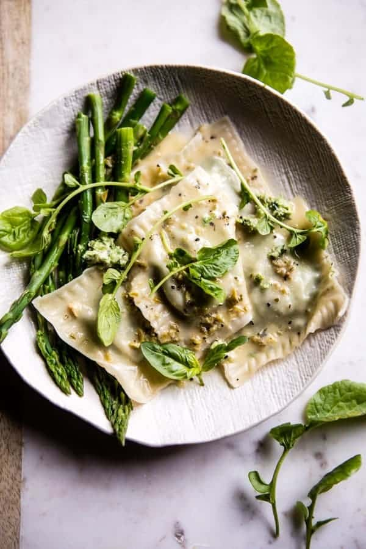

{width=100%}

**Prep Time:** 30 min | **Cook Time:** 15 min | **Total Time:** 45 min

## Ingredients

- 1 bunch asparagus, ends trimmed
- 1 cup fresh basil
- 1 cup whole milk ricotta cheese
- 1/2 cup grated parmesan cheese
- 1/4 cup roasted pistachios, shelloed
- juice + zest of 2 lemons
- kosher salt + pepper
- 40-50  circle or square wonton wrappers
- 4 tablespoons salted butter
- 2 tablespoons chopped chives
- 1 tablespoon chopped fresh thyme
- 1/2 cup white wine or chicken broth
- 1 cup low sodium chicken broth
- pinch of crushed red pepper

## Instructions

1. Bring a large pot of salted water to a boil. Add the asparagus and blanch until just tender, about 1-2 minutes. Drain and rinse under cold water.
1. In a food processor, combine 3/4 of the asparagus (reserve the remaining for serving), the basil, ricotta, parmesan, pistachios, lemon zest and juice, and a pinch each of salt and pepper. Pulse until combined and smooth.
1. Lay out about 6 wrappers. Spoon 1 tablespoon of filling into the center of each wrapper. Brush the edges with water. Lay a second wrapper on top of each ravioli. Press down the edges to seal, pressing out all the air. Crimp the edges with a fork. Alternately you can create triangles with the square wrappers if desired. Be sure to keep the ravioli's covered as you work to prevent them from drying out.
1. To make the butter sauce. In a large skillet, melt the butter over medium heat. Add the chives and thyme and cook 30 seconds to a minute or until fragrant. Pour in the wine and chicken broth and bring to a boil. Season with salt and pepper and a pinch of crushed red pepper. Cook 5 minutes or until the sauce has reduced slightly.
1. Meanwhile, bring a large pot of salted water to a boil. Boil the ravioli in batches for 1-2 minutes or until they float. Drain.
1. Divide the ravioli among bowls and ladle the sauce over the ravioli. Top with the remaining asparagus. EAT!

