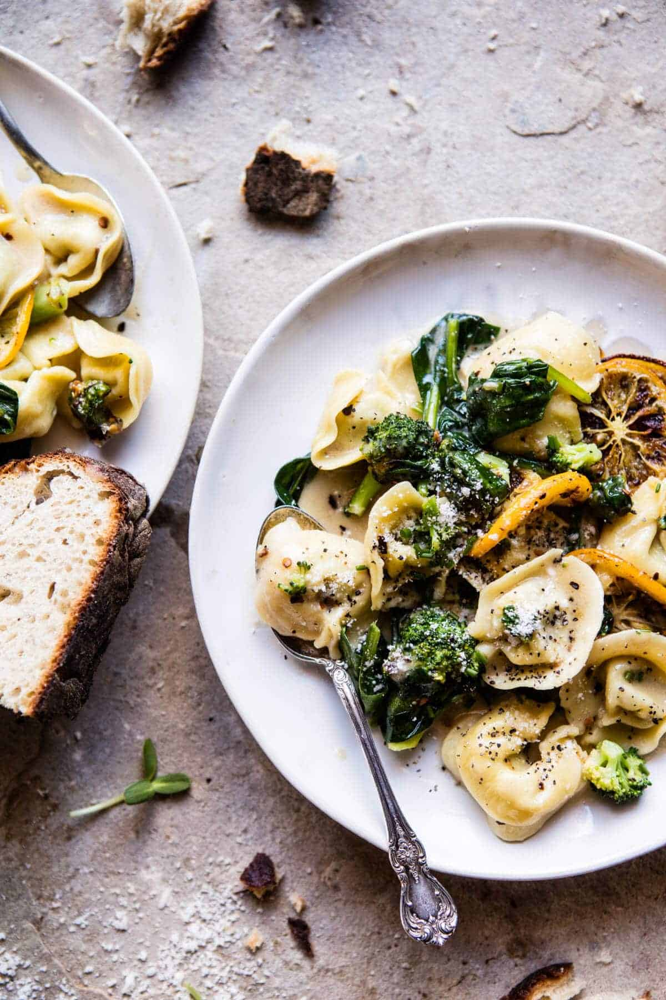

{width=100%}

**Prep Time:** 10 min | **Cook Time:** 10 min | **Total Time:** 20 min

## Ingredients

- 8 ounces cheese tortellini
- 2  heads broccoli, florets roughly chopped
- 2  lemons, preferably Meyer, thinly sliced
- 2 tablespoons olive oil
- 2  large handfuls baby spinach
- 1 tablespoon chopped fresh chives
- 4 tablespoons butter
- 1 cup grated manchego cheese
- 1 cup grated parmesan cheese
- pinch of crushed red pepper flakes
- kosher salt and pepper

## Instructions

1. Bring a large pot of salted water to a boil. Add the tortellini and broccoli and cook according to package directions until the tortellini is al dente, about 4-6 minutes. During the last minute of cooking, add the lemon slices. Just before draining, remove 1 cup of the pasta cooking water. Drain. Pick out the lemon slices. Return the pot to the stove and set over medium heat. Add the olive oil and lemon slices. Fry until lightly golden on each side, about 30 seconds to 1 minute. Remove the pot from the heat. Add the tortellini, broccoli, spinach, chives, butter, cheese and a splash of the pasta cooking water. Toss until the cheese has melted, adding more water, little by little to create a loose sauce. Season with crushed red pepper, salt and pepper. Enjoy!

