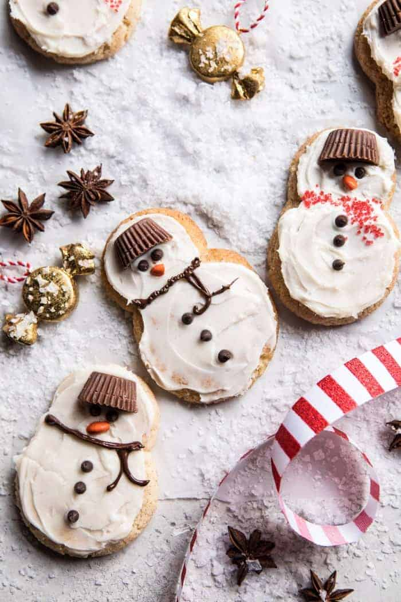

{width=100%}

**Prep Time:** 20 min | **Cook Time:** 10 min | **Total Time:** 30 min

## Ingredients

- 2 3/4 cups all-purpose flour
- 1 teaspoon baking soda
- 1/4 teaspoon baking powder
- 2 sticks (1 cup) salted butter, at room temperature
- 4 ounces cream cheese, at room temperature
- 1 cup granulated sugar
- 1  egg
- 2 teaspoons vanilla extract
- Mini Reese's, mini chocolate chips, sprinkles, and melted chocolate, for decorating
- 1/2 cup granulated sugar
- 2 teaspoons cinnamon
- 1/2 teaspoon ground ginger
- 1/2 teaspoon all-spice
- 1/2 teaspoon cardamom
- 1 stick (1/2 cup) salted butter
- 2 1/4 cups powdered sugar
- 2-4 tablespoons eggnog
- 1/4 teaspoon nutmeg

## Instructions

1. Preheat the oven to 375 degrees F. Line 2 baking sheets with parchment paper.
1. In a medium bowl, combine the flour, baking soda, and baking powder.
1. Using an electric mixer, in a large bowl beat together the butter, cream cheese, and sugar until light and fluffy, about 2 minutes. Add the egg and vanilla and beat until combined. Gradually add the flour mixture, mixing until just fully combined.
1. To make the chai spice sugar. In a small bowl, combine the sugar, cinnamon, ginger, all-spice, and cardamom.
1. Roll the dough into two sizes of balls. 16 (1 1/2 inch, about 1 tablespoon) size balls, and 16 (3/4 inch, about 2 teaspoons) size balls. Then generously roll through the chai sugar.
1. To make the snowmen, place 1 smaller baller and 1 larger ball together with the edges touching on the prepared baking sheet, spacing the cookies 2 inches apart. Repeat with the remaining dough balls. Transfer to the oven and bake for 8-10 minutes or until the cookies are just starting to set around the edges. Let cool completely.
1. To make the frosting, beat together the butter and sugar until creamy. Add the eggnog and nutmeg, beat to combine.
1. To frost the cooled cookies. Place half a mini Reese's atop the snowman's head. Decorate as desired with candies and melted chocolate.

