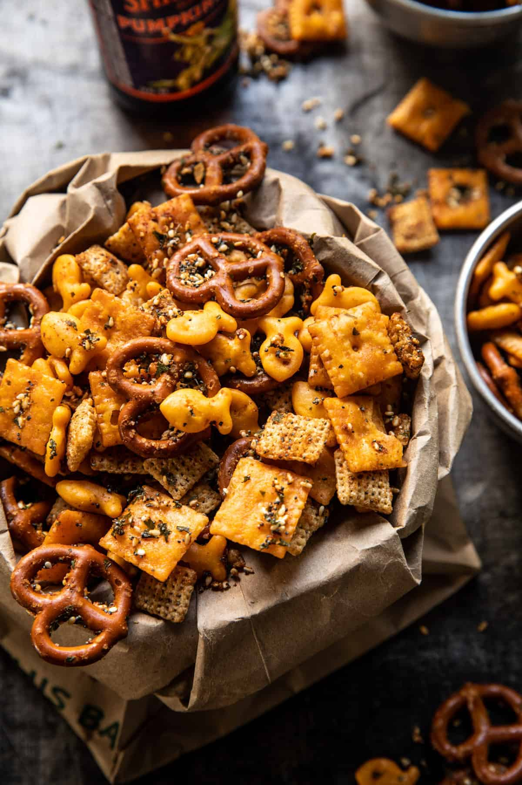

{width=100%}

**Prep Time:** 10 min | **Cook Time:** 30 min | **Total Time:** 40 min

## Ingredients

- 3 cups salted mini pretzel twists
- 3 cups mixed Cheez-Its and Goldfish crackers
- 2 cups Rice Chex Cereal
- 6 tablespoons salted butter, melted
- 1 tablespoon Worcestershire sauce
- 2 tablespoons raw sesame seeds
- 1 tablespoons poppy seeds
- 2 teaspoons dried parsley
- 2 teaspoons dried chives
- 1 teaspoon dried dill
- 1 1/2 teaspoons garlic powder
- 1 1/2 teaspoons onion powder
- 1 teaspoon each kosher salt and black pepper

## Instructions

1. Preheat oven to 300 degrees F. 2. In a large bowl, combine the butter, Worcestershire, sesame seeds, poppy seeds, parsley, chives, dill, garlic powder, onion powder, salt, and pepper. Add the pretzels, cheese crackers, and Chex, tossing well for 3-5 minutes or until the mixture is evenly coated. Spread the mix evenly over a rimmed baking sheet.
1. Transfer to the oven and bake 30-35 minutes, Toss 1-2 times throughout cooking. Serve, or store in an airtight container for up to 1 week.

