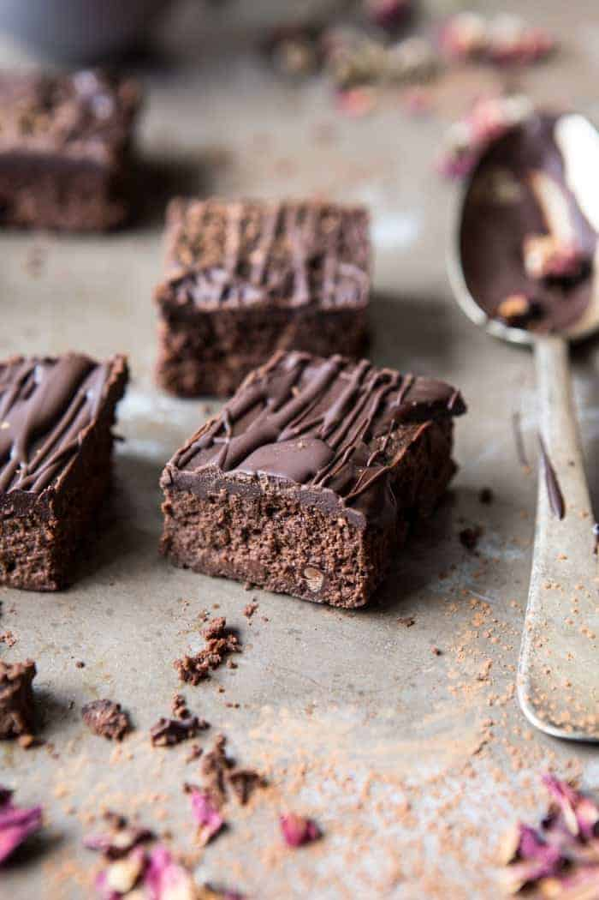

{width=100%}

**Prep Time:** 15 min | **Cook Time:** 30 min | **Total Time:** 45 min

## Ingredients

- 4 ounces dark chocolate, chopped
- 1 cup whole milk ricotta cheese
- 1/2 cup real maple syrup
- 2 teaspoons instant coffee  ((optional))
- 2 teaspoons vanilla extract
- 2  eggs
- 1/2 cup cocoa powder
- 1/2 cup almond meal/flour
- 1/4 teaspoon kosher salt
- 1/3 cup real maple syrup
- 1/4 cup coconut oil
- 2 ounces dark chocolate, chopped
- 1/3 cup cocoa powder

## Instructions

1. Preheat the oven to 350 degrees F. Line an 8x8 inch pan with parchment paper.
1. Heat 2 ounces dark chocolate in the microwave until melted and smooth. Stir in the ricotta, eggs, maple syrup, instant coffee, and vanilla until completely smooth and no clumps remain. Add the cocoa powder, almond meal, and salt. Stir until just combined. Stir in the remaining 2 ounces of chopped dark chocolate.
1. Evenly spread the mixture into the prepared baking pan. Bake for 30-35 minutes or until the brownies are just set. DO NOT over bake or these will become cakey. Allow to cool before frosting.
1. To make the frosting, melt together the maple syrup, coconut oil, and dark chocolate in a small saucepan over low heat until melted and smooth. Remove from the heat and stir in the cocoa power. Pour the frosting over the brownies and spread in an even layer. Place the brownies in the fridge and allow the frosting to set 30 minutes to 1 hour. Cut into bars and store in an airtight container in a cool, dry place or in the fridge. Enjoy!

