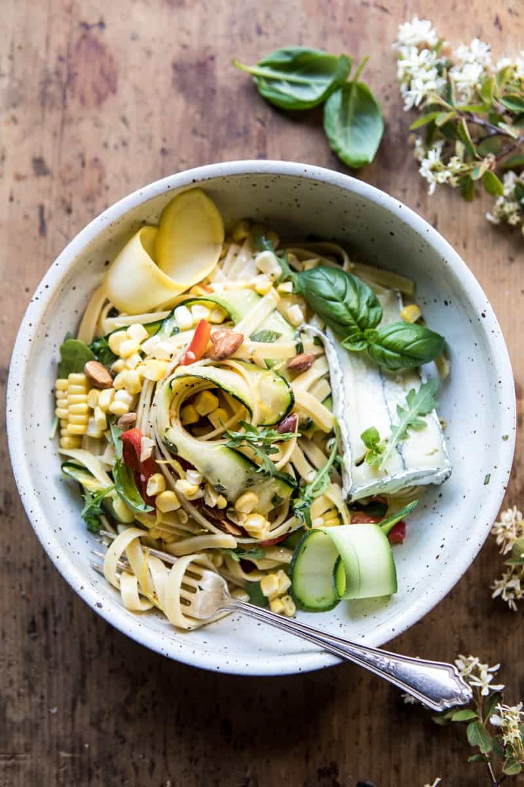

{width=100%}

**Prep Time:** 15 min | **Cook Time:** 10 min | **Total Time:** 25 min

## Ingredients

- 1/3 cup extra virgin olive oil
- 2 tablespoons balsamic vinegar
- 1 clove garlic, minced or grated
- juice + zest of 1 lemon
- 1/4 cup fresh basil, chopped
- 1 tablespoon chopped fresh oregano
- pinch of crushed red pepper flakes
- kosher salt and pepper
- 1  small zucchini, cut into ribbons
- 1  small yellow squash, cut into ribbons
- 1  red bell pepper, sliced thin
- 2  ears corn, kernels removed from the cob
- 1 (12 ounce) jar marinated artichokes, drained
- 1 pound fettuccine pasta
- 1/2 cup grated parmesan cheese
- 6 ounces aged or creamy goat cheese, crumbled
- fresh arugula and toasted almonds, for serving

## Instructions

1. In a medium bowl, combine the olive oil, balsamic vinegar, garlic, lemon zest and juice, basil, oregano, crushed red pepper flakes, and a pinch each of salt and pepper. Add the zucchini, yellow squash, red pepper, corn, and artichokes and toss to combine.
1. Bring a large pot of salted water to a boil. Cook the pasta according to package directions until al dente. Just before draining, remove 1 cup of the pasta cooking water. Drain and add the pasta right back to the pot. Add the 1/4 cup pasta cooking water, the parmesan, veggies and any oil left in the bowl and toss well to combine.
1. Divide the pasta among bowls and top with goat cheese, arugula, and almonds. Eat!

