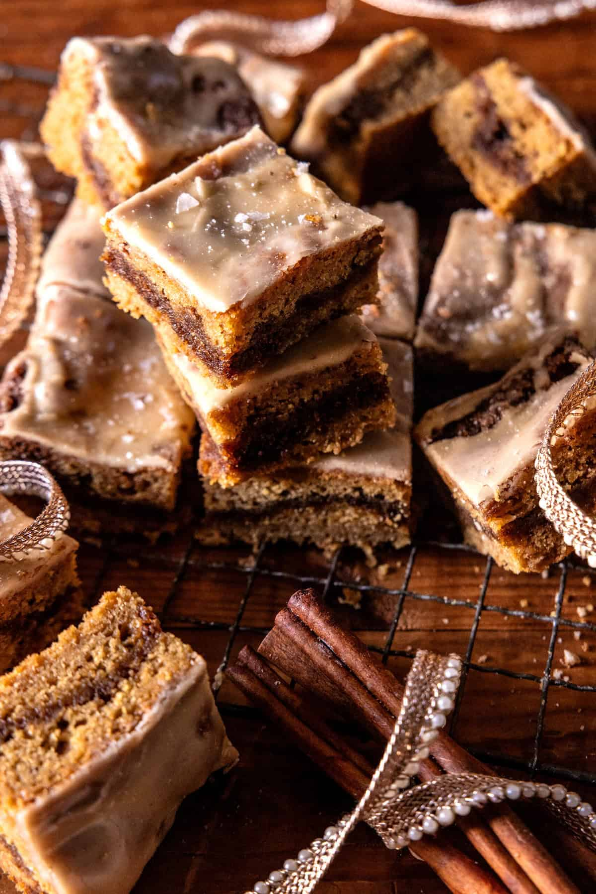

{width=100%}

**Prep Time:** 20 min | **Cook Time:** 30 min | **Total Time:** 50 min

## Ingredients

- 2 tablespoons salted butter, melted
- 1/2 cup brown sugar
- 1 tablespoon cinnamon
- 1 tablespoon all-purpose flour
- 1 1/2 sticks (3/4 cup) salted butter, melted and lightly browned
- ½ cup brown sugar
- 3  eggs, room temperature
- 1 teaspoon vanilla extract
- 1 1/2 cups all-purpose flour
- 1 teaspoon baking powder
- 1/4 teaspoon baking soda
- 1/2 teaspoon sea salt
- 1/3 cup spiced apple cider, no added sugar
- 1 cup powdered sugar
- 1 teaspoon  vanilla
- 2 tablespoons granulated sugar
- 1 teaspoon ground cinnamon

## Instructions

1. To make the cinnamon swirl. Mix all ingredients until clumps form. Set aside.
1. To make the bars. Preheat oven to 350°F. Line an 8-inch square baking dish with parchment paper.
1. In a bowl, beat the butter, brown sugar, eggs, and vanilla. Add the flour, baking powder, baking soda, and salt, beating until combined.
1. Spread half of the batter into the bottom of the prepared dish. Sprinkle the cinnamon swirl. Dollop remaining batter on top, spread in an even layer. It's OK if the batter does not cover the surface. The cinnamon swirl can peak out!
1. Bake for 30 to 35 minutes, until fully set.
1. Meanwhile, make the frosting. Bring the apple cider to a boil over high heat. Simmer 5 minutes or until reduced to 2-3 tablespoons. Mix in the powdered sugar and vanilla until smooth. Pour the warm frosting over the bars. Allow the frosting to set, at least 1 hour. 7. Mix the cinnamon and sugar, then dust with a very light sprinkle of cinnamon sugar and flaked sea salt (optional).Â

