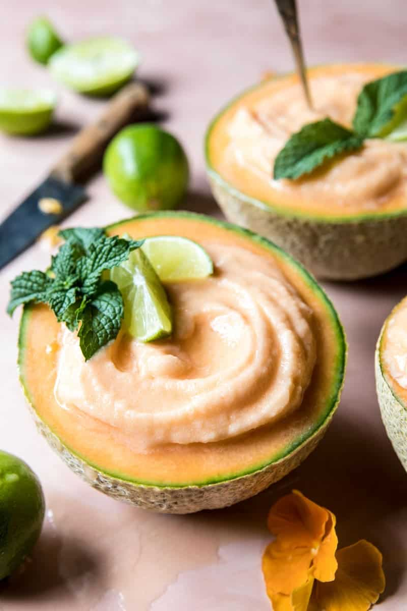

{width=100%}

**Prep Time:** 10 min | **Cook Time:**  | **Total Time:** 10 min

## Ingredients

- 2 cups frozen cantaloupe chunks  ((freeze chunks for at least 1-2 hours))
- 1/2 cup unsweetened coconut milk
- 1/4 cup sliver tequila
- 1/4 cup lime juice
- 2 tablespoons Cointreau
- 1-2 tablespoons agave or honey, to taste
- salt, for the rims  ((optional))

## Instructions

1. Slice a thin piece of rind off both ends of cantaloupe so that it can stand upright. Cut in half horizontally and remove seeds. Scoop out flesh and set aside, save cantaloupe halves.
1. In a blender, combine the cantaloupe, coconut milk, tequila, lime juice, Cointreau and agave, pulse until smooth. If needed, add ice to get a slushy consistency. Divide between cantaloupe bowls (halves) and drink!

